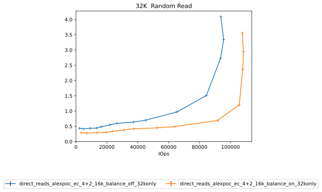

Comparitive Performance Report for direct-reads-alexpoc-ec-4+2-16k-balance-off-32konly vs direct-reads-alexpoc-ec-4+2-16k-balance-on-32konly
============================================================================================================================================

Table of contents
=================

* [Comparison summary for direct-reads-alexpoc-ec-4+2-16k-balance-off-32konly vs direct-reads-alexpoc-ec-4+2-16k-balance-on-32konly](#comparison-summary-for-direct-reads-alexpoc-ec-42-16k-balance-off-32konly-vs-direct-reads-alexpoc-ec-42-16k-balance-on-32konly)
* [Response Curves](#response-curves)
	* [Random Read](#random-read)
* [Configuration yaml files](#configuration-yaml-files)
	* [results](#results)

# Comparison summary for direct-reads-alexpoc-ec-4+2-16k-balance-off-32konly vs direct-reads-alexpoc-ec-4+2-16k-balance-on-32konly
  
  
  
|Random Read|direct_reads_alexpoc_ec_4+2_16k_balance_off_32konly|direct_reads_alexpoc_ec_4+2_16k_balance_on_32konly|%change throughput|%change latency|  
| :--- | ---: | ---: | ---: | ---: |  
|[32K](#32768-randread)|95564 IOps@3.3ms|108436 IOps@2.9ms|13%|-12%|  
  
  
  

# Response Curves

## Random Read

|||
| :---: | :---: |
|<a name="32768-randread"></a>||

# Configuration yaml files


Only yaml files that differ by more than 20 lines from the yaml file for the baseline directory will be added here in addition to the baseline yaml  

## results


```benchmarks:
  librbdfio:
    cmd_path: /usr/local/bin/fio2
    create_report: true
    fio_out_format: json
    log_avg_msec: 100
    log_bw: true
    log_iops: true
    log_lat: true
    norandommap: true
    osd_ra:
    - 4096
    poolname: rbd_replicated
    prefill:
      blocksize: 64k
      numjobs: 1
    procs_per_volume:
    - 1
    ramp: 30
    rbdname: cbt-librbdfio
    time: 90
    time_based: true
    use_existing_volumes: true
    vol_size: 10
    volumes_per_client:
    - 16
    wait_pgautoscaler_timeout: 10
    workloads:
      32krandomread:
        jobname: randread
        mode: randread
        numjobs:
        - 1
        op_size: 32768
        total_iodepth:
        - 1
        - 2
        - 4
        - 6
        - 8
        - 12
        - 16
        - 24
        - 32
        - 64
        - 128
        - 256
        - 320
        - 384
      precondition:
        jobname: precond1rw
        mode: randwrite
        monitor: false
        numjobs:
        - 1
        op_size: 65536
        time: 10
        total_iodepth:
        - 16
cluster:
  archive_dir: /tmp/cbt
  ceph-mgr_cmd: /usr/bin/ceph-mgr
  ceph-mon_cmd: /usr/bin/ceph-mon
  ceph-osd_cmd: /usr/bin/ceph-osd
  ceph-run_cmd: /usr/bin/ceph-run
  ceph_cmd: /usr/bin/ceph
  clients:
  - --- server1 ---
  clusterid: ceph
  conf_file: /cbt/ceph.conf.4x1x1.fs
  fs: xfs
  head: --- server1 ---
  iterations: 1
  mgrs:
    --- server1 ---:
      a: null
  mkfs_opts: -f -i size=2048
  mons:
    --- server1 ---:
      a: --- IP Address ---:6789
  mount_opts: -o inode64,noatime,logbsize=256k
  osds:
  - --- server1 ---
  osds_per_node: 6
  pdsh_ssh_args: -a -x -l%u %h
  rados_cmd: /usr/bin/rados
  rbd_cmd: /usr/bin/rbd
  tmp_dir: /tmp/cbt
  use_existing: true
  user: root
monitoring_profiles:
  collectl:
    args: -c 18 -sCD -i 10 -P -oz -F0 --rawtoo --sep ";" -f {collectl_dir}
```