Comparitive Performance Report for direct-reads-3-way-replica-balance-reads-off vs direct-reads-3-way-replica-balance-reads-on-run2
===================================================================================================================================

Table of contents
=================

* [Comparison summary for direct-reads-3-way-replica-balance-reads-off vs direct-reads-3-way-replica-balance-reads-on-run2](#comparison-summary-for-direct-reads-3-way-replica-balance-reads-off-vs-direct-reads-3-way-replica-balance-reads-on-run2)
* [Response Curves](#response-curves)
	* [Sequential Read](#sequential-read)
	* [Random Read](#random-read)
	* [Random Read/Write](#random-readwrite)
* [Configuration yaml files](#configuration-yaml-files)
	* [results](#results)

# Comparison summary for direct-reads-3-way-replica-balance-reads-off vs direct-reads-3-way-replica-balance-reads-on-run2
  
|Sequential Read|direct_reads_3_way_replica_balance_reads_off|direct_reads_3_way_replica_balance_reads_on_run2|%change throughput|%change latency|  
| :--- | ---: | ---: | ---: | ---: |  
|[4K](#4096-read)|143709 IOps@0.9ms|107034 IOps@3.6ms|-26%|300%|  
|[8K](#8192-read)|128312 IOps@2.0ms|105672 IOps@3.6ms|-18%|80%|  
|[16K](#16384-read)|114997 IOps@3.3ms|103105 IOps@3.7ms|-10%|12%|  
|[32K](#32768-read)|93769 IOps@4.1ms|97390 IOps@3.9ms|4%|-5%|  
|[64K](#65536-read)|4924 MB/s@5.1ms|5606 MB/s@4.5ms|14%|-12%|  
|[128K](#131072-read)|7892 MB/s@6.4ms|8767 MB/s@5.7ms|11%|-11%|  
|[256K](#262144-read)|11395 MB/s@8.8ms|11861 MB/s@8.5ms|4%|-3%|  
|[384K](#393216-read)|12083 MB/s@16.7ms|11613 MB/s@5.4ms|-4%|-68%|  
|[512K](#524288-read)|12749 MB/s@21.1ms|11295 MB/s@11.9ms|-11%|-44%|  
|[768K](#786432-read)|12639 MB/s@31.9ms|10795 MB/s@9.3ms|-15%|-71%|  
|[1024K](#1048576-read)|12511 MB/s@10.7ms|11363 MB/s@5.9ms|-9%|-45%|  
|[2048K](#2097152-read)|11441 MB/s@11.7ms|11182 MB/s@6.0ms|-2%|-49%|  
|[4096K](#4194304-read)|10356 MB/s@12.9ms|10778 MB/s@9.3ms|4%|-28%|  
  
  
|Random Read|direct_reads_3_way_replica_balance_reads_off|direct_reads_3_way_replica_balance_reads_on_run2|%change throughput|%change latency|  
| :--- | ---: | ---: | ---: | ---: |  
|[4K](#4096-randread)|159762 IOps@2.4ms|108657 IOps@3.5ms|-32%|46%|  
|[8K](#8192-randread)|149927 IOps@2.6ms|104567 IOps@3.7ms|-30%|42%|  
|[16K](#16384-randread)|140977 IOps@2.7ms|100039 IOps@3.8ms|-29%|41%|  
|[32K](#32768-randread)|121409 IOps@2.6ms|91446 IOps@4.2ms|-25%|62%|  
|[64K](#65536-randread)|6234 MB/s@4.0ms|5127 MB/s@4.9ms|-18%|23%|  
|[128K](#131072-randread)|9393 MB/s@3.6ms|8126 MB/s@4.1ms|-13%|14%|  
|[256K](#262144-randread)|12027 MB/s@7.0ms|11012 MB/s@3.0ms|-8%|-57%|  
|[384K](#393216-randread)|12422 MB/s@5.1ms|11309 MB/s@4.4ms|-9%|-14%|  
|[512K](#524288-randread)|12548 MB/s@5.3ms|10471 MB/s@6.4ms|-17%|21%|  
|[768K](#786432-randread)|12242 MB/s@8.2ms|10410 MB/s@4.8ms|-15%|-41%|  
|[1024K](#1048576-randread)|12205 MB/s@5.5ms|11034 MB/s@6.1ms|-10%|11%|  
|[2048K](#2097152-randread)|11184 MB/s@12.0ms|11147 MB/s@6.0ms|-0%|-50%|  
|[4096K](#4194304-randread)|10313 MB/s@13.0ms|10898 MB/s@9.2ms|6%|-29%|  
  
  
  
|Random Read/Write|direct_reads_3_way_replica_balance_reads_off|direct_reads_3_way_replica_balance_reads_on_run2|%change throughput|%change latency|  
| :--- | ---: | ---: | ---: | ---: |  
|[4K_70/30 ](#4096-70-30-randrw)|86087 IOps@3.0ms|63744 IOps@6.0ms|-26%|100%|  
|[16K_70/30 ](#16384-70-30-randrw)|77812 IOps@4.1ms|59743 IOps@6.4ms|-23%|56%|  
|[64K_70/30 ](#65536-70-30-randrw)|3809 MB/s@6.6ms|3147 MB/s@6.6ms|-17%|0%|  
|[64K_30/70 ](#65536-30-70-randrw)|2696 MB/s@7.7ms|2246 MB/s@9.3ms|-17%|21%|  

# Response Curves

## Sequential Read

|||
| :---: | :---: |
|<a name="4096-read"></a>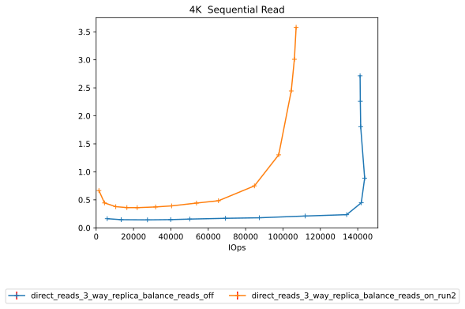|<a name="8192-read"></a>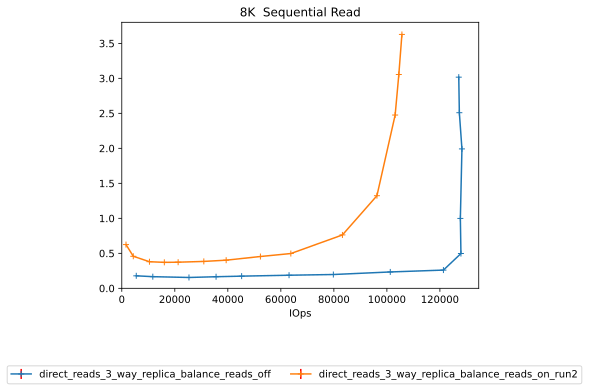|
|<a name="16384-read"></a>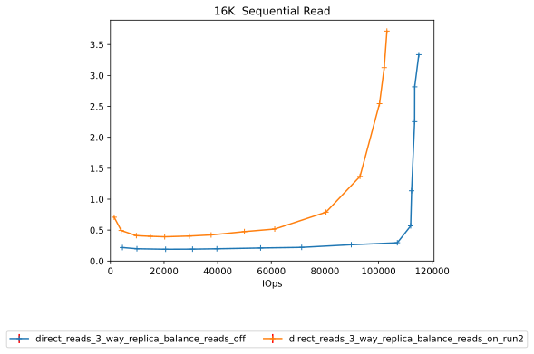|<a name="32768-read"></a>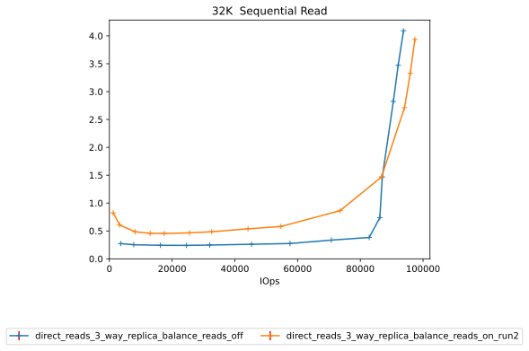|
|<a name="65536-read"></a>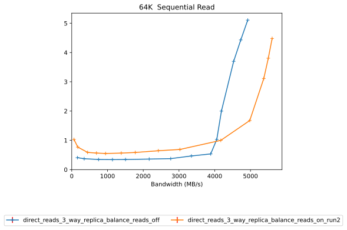|<a name="131072-read"></a>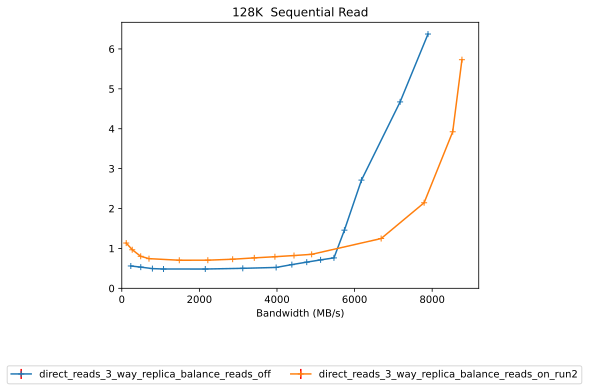|
|<a name="262144-read"></a>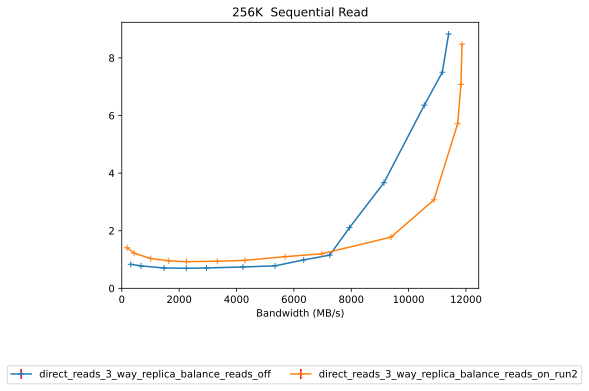|<a name="393216-read"></a>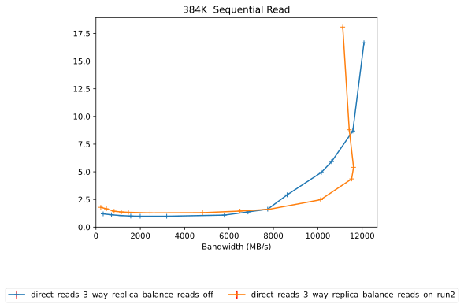|
|<a name="524288-read"></a>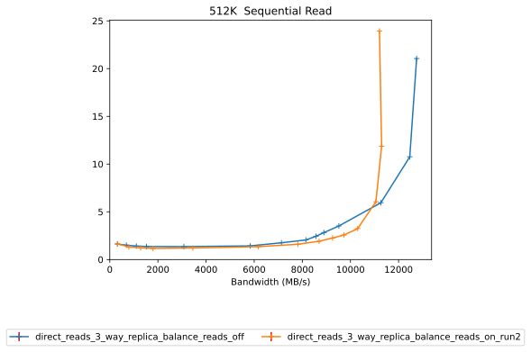|<a name="786432-read"></a>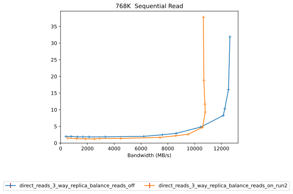|
|<a name="1048576-read"></a>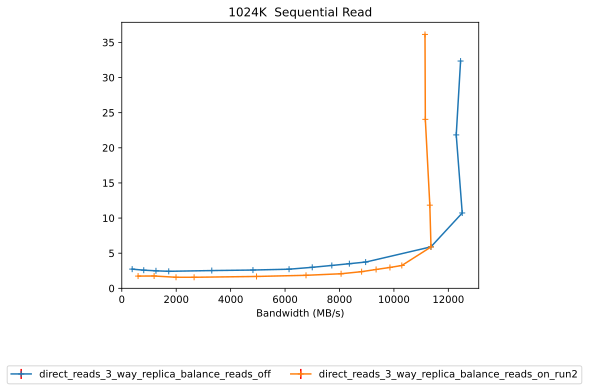|<a name="2097152-read"></a>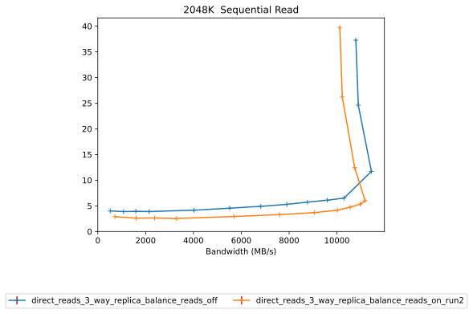|
|<a name="4194304-read"></a>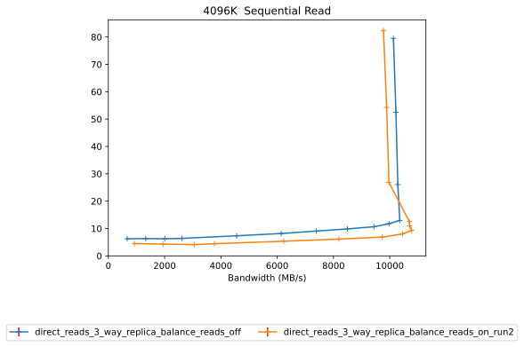||

## Random Read

|||
| :---: | :---: |
|<a name="4096-randread"></a>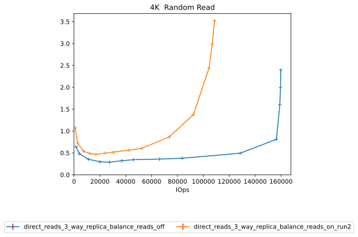|<a name="8192-randread"></a>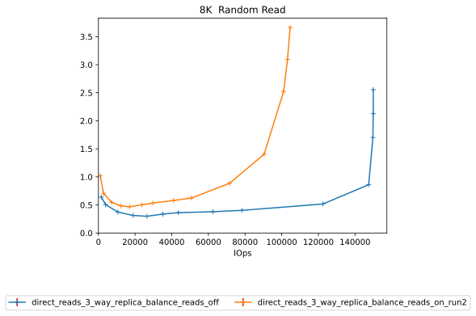|
|<a name="16384-randread"></a>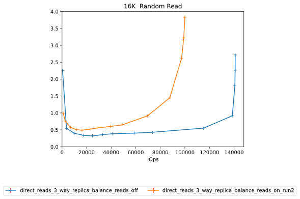|<a name="32768-randread"></a>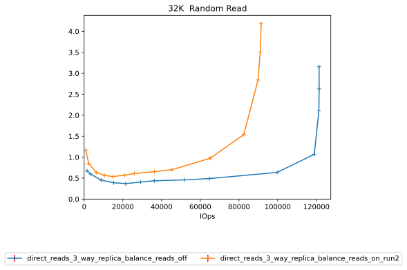|
|<a name="65536-randread"></a>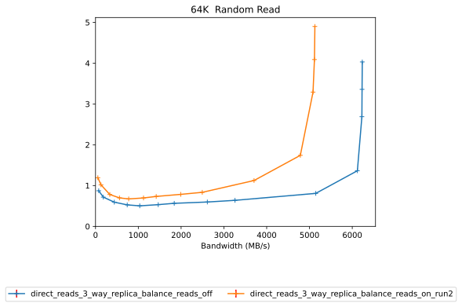|<a name="131072-randread"></a>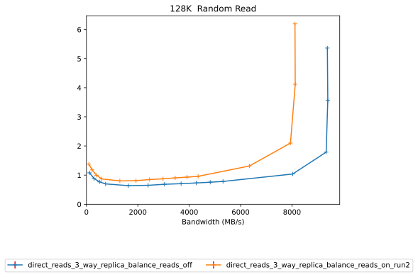|
|<a name="262144-randread"></a>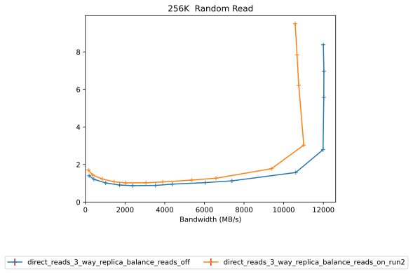|<a name="393216-randread"></a>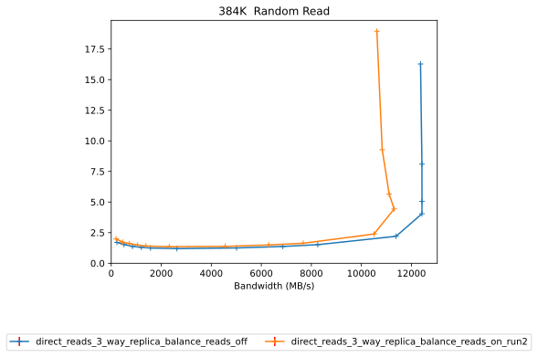|
|<a name="524288-randread"></a>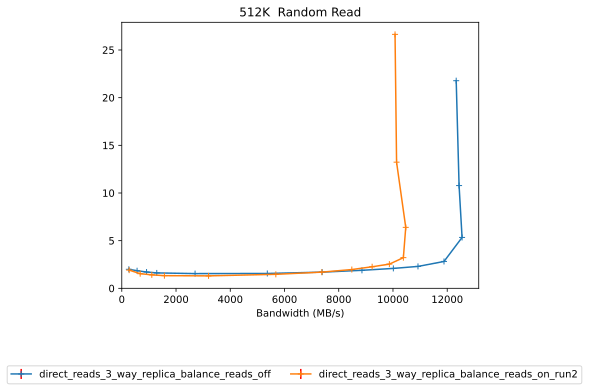|<a name="786432-randread"></a>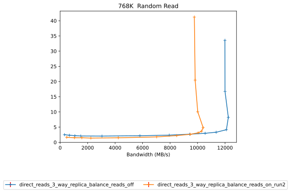|
|<a name="1048576-randread"></a>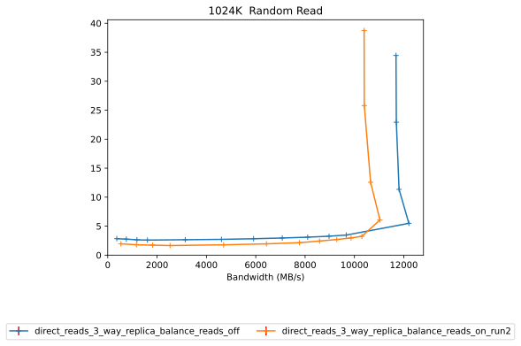|<a name="2097152-randread"></a>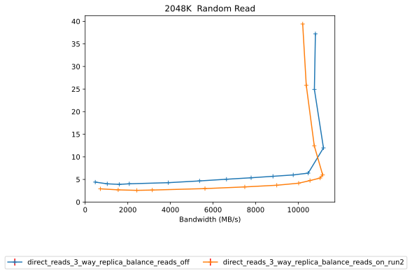|
|<a name="4194304-randread"></a>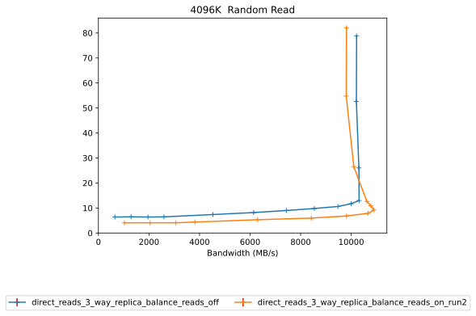||

## Random Read/Write

|||
| :---: | :---: |
|<a name="4096-70-30-randrw"></a>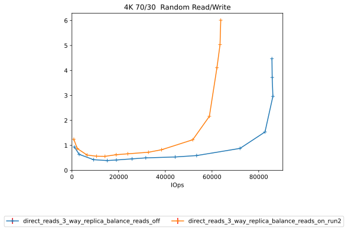|<a name="16384-70-30-randrw"></a>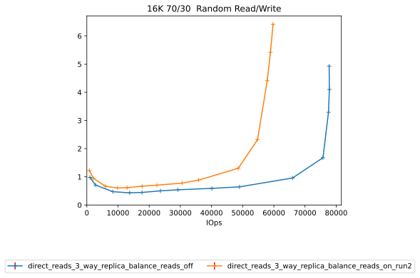|
|<a name="65536-70-30-randrw"></a>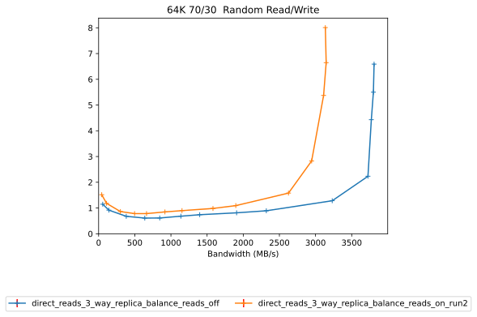|<a name="65536-30-70-randrw"></a>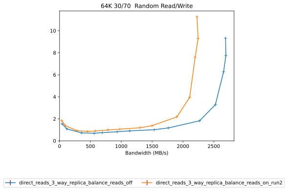|

# Configuration yaml files


Only yaml files that differ by more than 20 lines from the yaml file for the baseline directory will be added here in addition to the baseline yaml  

## results


```benchmarks:
  librbdfio:
    cmd_path: /usr/local/bin/fio2
    create_report: true
    fio_out_format: json
    log_avg_msec: 100
    log_bw: true
    log_iops: true
    log_lat: true
    norandommap: true
    osd_ra:
    - 4096
    poolname: rbd_replicated
    prefill:
      blocksize: 64k
      numjobs: 1
    procs_per_volume:
    - 1
    ramp: 30
    rbdname: cbt-librbdfio
    time: 90
    time_based: true
    use_existing_volumes: true
    vol_size: 1000
    volumes_per_client:
    - 16
    wait_pgautoscaler_timeout: 10
    workloads:
      128krandomread:
        jobname: randread
        mode: randread
        numjobs:
        - 1
        op_size: 131072
        total_iodepth:
        - 1
        - 2
        - 3
        - 4
        - 8
        - 12
        - 16
        - 20
        - 24
        - 28
        - 32
        - 64
        - 128
        - 256
        - 384
      128ksequentialread:
        jobname: seqread
        mode: read
        numjobs:
        - 1
        op_size: 131072
        total_iodepth:
        - 1
        - 2
        - 3
        - 4
        - 8
        - 12
        - 16
        - 20
        - 24
        - 28
        - 32
        - 64
        - 128
        - 256
        - 384
      16kmixread70:
        jobname: mixread
        mode: randrw
        numjobs:
        - 1
        op_size: 16384
        rwmixread: 70
        total_iodepth:
        - 1
        - 2
        - 4
        - 6
        - 8
        - 12
        - 16
        - 24
        - 32
        - 64
        - 128
        - 256
        - 320
        - 384
      16krandomread:
        jobname: randread
        mode: randread
        numjobs:
        - 1
        op_size: 16384
        total_iodepth:
        - 1
        - 2
        - 4
        - 6
        - 8
        - 12
        - 16
        - 24
        - 32
        - 64
        - 128
        - 256
        - 320
        - 384
      16ksequentialread:
        jobname: seqread
        mode: read
        numjobs:
        - 1
        op_size: 16384
        total_iodepth:
        - 1
        - 2
        - 4
        - 6
        - 8
        - 12
        - 16
        - 24
        - 32
        - 64
        - 128
        - 256
        - 320
        - 384
      1Mrandomread:
        jobname: randread
        mode: randread
        numjobs:
        - 1
        op_size: 1048576
        total_iodepth:
        - 1
        - 2
        - 3
        - 4
        - 8
        - 12
        - 16
        - 20
        - 24
        - 28
        - 32
        - 64
        - 128
        - 256
        - 384
      1Msequentialread:
        jobname: seqread
        mode: read
        numjobs:
        - 1
        op_size: 1048576
        total_iodepth:
        - 1
        - 2
        - 3
        - 4
        - 8
        - 12
        - 16
        - 20
        - 24
        - 28
        - 32
        - 64
        - 128
        - 256
        - 384
      256krandomread:
        jobname: randomread
        mode: randread
        numjobs:
        - 1
        op_size: 262144
        total_iodepth:
        - 1
        - 2
        - 4
        - 6
        - 8
        - 12
        - 16
        - 24
        - 32
        - 64
        - 128
        - 256
        - 320
        - 384
      256ksequentialread:
        jobname: seqread
        mode: read
        numjobs:
        - 1
        op_size: 262144
        total_iodepth:
        - 1
        - 2
        - 4
        - 6
        - 8
        - 12
        - 16
        - 24
        - 32
        - 64
        - 128
        - 256
        - 320
        - 384
      2Mrandomread:
        jobname: randread
        mode: randread
        numjobs:
        - 1
        op_size: 2097152
        total_iodepth:
        - 1
        - 2
        - 3
        - 4
        - 8
        - 12
        - 16
        - 20
        - 24
        - 28
        - 32
        - 64
        - 128
        - 192
      2Msequentialread:
        jobname: seqread
        mode: read
        numjobs:
        - 1
        op_size: 2097152
        total_iodepth:
        - 1
        - 2
        - 3
        - 4
        - 8
        - 12
        - 16
        - 20
        - 24
        - 28
        - 32
        - 64
        - 128
        - 192
      32krandomread:
        jobname: randread
        mode: randread
        numjobs:
        - 1
        op_size: 32768
        total_iodepth:
        - 1
        - 2
        - 4
        - 6
        - 8
        - 12
        - 16
        - 24
        - 32
        - 64
        - 128
        - 256
        - 320
        - 384
      32ksequentialread:
        jobname: seqread
        mode: read
        numjobs:
        - 1
        op_size: 32768
        total_iodepth:
        - 1
        - 2
        - 4
        - 6
        - 8
        - 12
        - 16
        - 24
        - 32
        - 64
        - 128
        - 256
        - 320
        - 384
      384krandomread:
        jobname: randread
        mode: randread
        numjobs:
        - 1
        op_size: 393216
        total_iodepth:
        - 1
        - 2
        - 3
        - 4
        - 5
        - 8
        - 16
        - 24
        - 32
        - 64
        - 128
        - 160
        - 256
        - 512
      384ksequentialread:
        jobname: seqread
        mode: read
        numjobs:
        - 1
        op_size: 393216
        total_iodepth:
        - 1
        - 2
        - 3
        - 4
        - 5
        - 8
        - 16
        - 24
        - 32
        - 64
        - 128
        - 160
        - 256
        - 512
      4Mrandomread:
        jobname: randread
        mode: randread
        numjobs:
        - 1
        op_size: 4194304
        total_iodepth:
        - 1
        - 2
        - 3
        - 4
        - 8
        - 12
        - 16
        - 20
        - 24
        - 28
        - 32
        - 64
        - 128
        - 192
      4Msequentialread:
        jobname: seqread
        mode: read
        numjobs:
        - 1
        op_size: 4194304
        total_iodepth:
        - 1
        - 2
        - 3
        - 4
        - 8
        - 12
        - 16
        - 20
        - 24
        - 28
        - 32
        - 64
        - 128
        - 192
      4kmixread70:
        jobname: mixread
        mode: randrw
        numjobs:
        - 1
        op_size: 4096
        rwmixread: 70
        total_iodepth:
        - 1
        - 2
        - 4
        - 6
        - 8
        - 12
        - 16
        - 24
        - 32
        - 64
        - 128
        - 256
        - 320
        - 384
      4krandomread:
        jobname: randread
        mode: randread
        numjobs:
        - 1
        op_size: 4096
        total_iodepth:
        - 1
        - 2
        - 4
        - 6
        - 8
        - 12
        - 16
        - 24
        - 32
        - 64
        - 128
        - 256
        - 320
        - 384
      4ksequentialread:
        jobname: seqread
        mode: read
        numjobs:
        - 1
        op_size: 4096
        total_iodepth:
        - 1
        - 2
        - 4
        - 6
        - 8
        - 12
        - 16
        - 24
        - 32
        - 64
        - 128
        - 256
        - 320
        - 384
      512krandomread:
        jobname: randread
        mode: randread
        numjobs:
        - 1
        op_size: 524288
        total_iodepth:
        - 1
        - 2
        - 3
        - 4
        - 8
        - 16
        - 24
        - 32
        - 40
        - 48
        - 64
        - 128
        - 256
        - 512
      512ksequentialread:
        jobname: seqread
        mode: read
        numjobs:
        - 1
        op_size: 524288
        total_iodepth:
        - 1
        - 2
        - 3
        - 4
        - 8
        - 16
        - 24
        - 32
        - 40
        - 48
        - 64
        - 128
        - 256
        - 512
      64kmixread30:
        jobname: mixread
        mode: randrw
        numjobs:
        - 1
        op_size: 65536
        rwmixread: 30
        total_iodepth:
        - 1
        - 2
        - 4
        - 6
        - 8
        - 12
        - 16
        - 24
        - 32
        - 64
        - 128
        - 256
        - 320
        - 384
      64kmixread70:
        jobname: mixread
        mode: randrw
        numjobs:
        - 1
        op_size: 65536
        rwmixread: 70
        total_iodepth:
        - 1
        - 2
        - 4
        - 6
        - 8
        - 12
        - 16
        - 24
        - 32
        - 64
        - 128
        - 256
        - 320
        - 384
      64krandomread:
        jobname: randread
        mode: randread
        numjobs:
        - 1
        op_size: 65536
        total_iodepth:
        - 1
        - 2
        - 4
        - 6
        - 8
        - 12
        - 16
        - 24
        - 32
        - 64
        - 128
        - 256
        - 320
        - 384
      64ksequentialread:
        jobname: seqread
        mode: read
        numjobs:
        - 1
        op_size: 65536
        total_iodepth:
        - 1
        - 2
        - 4
        - 6
        - 8
        - 12
        - 16
        - 24
        - 32
        - 64
        - 128
        - 256
        - 320
        - 384
      768krandomread:
        jobname: randread
        mode: randread
        numjobs:
        - 1
        op_size: 786432
        total_iodepth:
        - 1
        - 2
        - 3
        - 4
        - 8
        - 16
        - 24
        - 32
        - 40
        - 48
        - 64
        - 128
        - 256
        - 512
      768ksequentialread:
        jobname: seqread
        mode: read
        numjobs:
        - 1
        op_size: 786432
        total_iodepth:
        - 1
        - 2
        - 3
        - 4
        - 5
        - 8
        - 16
        - 24
        - 32
        - 64
        - 128
        - 160
        - 256
        - 512
      8krandomread:
        jobname: randread
        mode: randread
        numjobs:
        - 1
        op_size: 8192
        total_iodepth:
        - 1
        - 2
        - 4
        - 6
        - 8
        - 12
        - 16
        - 24
        - 32
        - 64
        - 128
        - 256
        - 320
        - 384
      8ksequentialread:
        jobname: seqread
        mode: read
        numjobs:
        - 1
        op_size: 8192
        total_iodepth:
        - 1
        - 2
        - 4
        - 6
        - 8
        - 12
        - 16
        - 24
        - 32
        - 64
        - 128
        - 256
        - 320
        - 384
      precondition:
        jobname: precond1rw
        mode: randwrite
        monitor: false
        numjobs:
        - 1
        op_size: 65536
        time: 600
        total_iodepth:
        - 16
cluster:
  archive_dir: /tmp/cbt
  ceph-mgr_cmd: /usr/bin/ceph-mgr
  ceph-mon_cmd: /usr/bin/ceph-mon
  ceph-osd_cmd: /usr/bin/ceph-osd
  ceph-run_cmd: /usr/bin/ceph-run
  ceph_cmd: /usr/bin/ceph
  clients:
  - --- server1 ---
  clusterid: ceph
  conf_file: /cbt/ceph.conf.4x1x1.fs
  fs: xfs
  head: --- server1 ---
  iterations: 1
  mgrs:
    --- server1 ---:
      a: null
  mkfs_opts: -f -i size=2048
  mons:
    --- server1 ---:
      a: --- IP Address ---:6789
  mount_opts: -o inode64,noatime,logbsize=256k
  osds:
  - --- server1 ---
  osds_per_node: 6
  pdsh_ssh_args: -a -x -l%u %h
  rados_cmd: /usr/bin/rados
  rbd_cmd: /usr/bin/rbd
  tmp_dir: /tmp/cbt
  use_existing: true
  user: cjames
monitoring_profiles:
  collectl:
    args: -c 18 -sCD -i 10 -P -oz -F0 --rawtoo --sep ";" -f {collectl_dir}
```