Comparitive Performance Report for direct-reads-ec-2+2-16k-balance-off-rerun-pr2 vs direct-reads-ec-2+2-16k-balance-reads-on
============================================================================================================================

Table of contents
=================

* [Comparison summary for direct-reads-ec-2+2-16k-balance-off-rerun-pr2 vs direct-reads-ec-2+2-16k-balance-reads-on](#comparison-summary-for-direct-reads-ec-22-16k-balance-off-rerun-pr2-vs-direct-reads-ec-22-16k-balance-reads-on)
* [Response Curves](#response-curves)
	* [Sequential Read](#sequential-read)
	* [Random Read](#random-read)
	* [Random Read/Write](#random-readwrite)
* [Configuration yaml files](#configuration-yaml-files)
	* [results](#results)

# Comparison summary for direct-reads-ec-2+2-16k-balance-off-rerun-pr2 vs direct-reads-ec-2+2-16k-balance-reads-on
  
|Sequential Read|direct_reads_ec_2+2_16k_balance_off_rerun_pr2|direct_reads_ec_2+2_16k_balance_reads_on|%change throughput|%change latency|  
| :--- | ---: | ---: | ---: | ---: |  
|[4K](#4096-read)|77727 IOps@4.9ms|126585 IOps@2.5ms|63%|-49%|  
|[8K](#8192-read)|77329 IOps@5.0ms|120976 IOps@2.1ms|56%|-58%|  
|[16K](#16384-read)|75168 IOps@5.1ms|113797 IOps@3.4ms|51%|-33%|  
|[32K](#32768-read)|57447 IOps@6.7ms|67601 IOps@5.7ms|18%|-15%|  
|[64K](#65536-read)|3353 MB/s@7.5ms|3689 MB/s@6.8ms|10%|-9%|  
|[128K](#131072-read)|5711 MB/s@8.8ms|6266 MB/s@8.0ms|10%|-9%|  
|[256K](#262144-read)|8330 MB/s@12.1ms|8538 MB/s@11.8ms|2%|-2%|  
|[384K](#393216-read)|9469 MB/s@21.3ms|9402 MB/s@21.4ms|-1%|0%|  
|[512K](#524288-read)|10213 MB/s@26.3ms|9857 MB/s@27.2ms|-3%|3%|  
|[768K](#786432-read)|10354 MB/s@38.9ms|9833 MB/s@41.0ms|-5%|5%|  
|[1024K](#1048576-read)|10544 MB/s@38.2ms|9884 MB/s@40.7ms|-6%|7%|  
|[2048K](#2097152-read)|9725 MB/s@27.6ms|9072 MB/s@29.6ms|-7%|7%|  
|[4096K](#4194304-read)|8989 MB/s@89.6ms|8363 MB/s@32.1ms|-7%|-64%|  
  
  
|Random Read|direct_reads_ec_2+2_16k_balance_off_rerun_pr2|direct_reads_ec_2+2_16k_balance_reads_on|%change throughput|%change latency|  
| :--- | ---: | ---: | ---: | ---: |  
|[4K](#4096-randread)|75857 IOps@5.1ms|110417 IOps@3.5ms|46%|-31%|  
|[8K](#8192-randread)|73165 IOps@4.4ms|105998 IOps@3.0ms|45%|-32%|  
|[16K](#16384-randread)|70725 IOps@5.4ms|100922 IOps@3.8ms|43%|-30%|  
|[32K](#32768-randread)|49626 IOps@7.7ms|63760 IOps@6.0ms|28%|-22%|  
|[64K](#65536-randread)|2890 MB/s@8.7ms|3503 MB/s@4.8ms|21%|-45%|  
|[128K](#131072-randread)|4996 MB/s@10.1ms|5714 MB/s@5.9ms|14%|-42%|  
|[256K](#262144-randread)|7745 MB/s@13.0ms|8084 MB/s@8.3ms|4%|-36%|  
|[384K](#393216-randread)|8947 MB/s@11.2ms|8708 MB/s@23.1ms|-3%|106%|  
|[512K](#524288-randread)|9687 MB/s@27.7ms|9252 MB/s@29.0ms|-4%|5%|  
|[768K](#786432-randread)|9963 MB/s@40.5ms|9337 MB/s@43.1ms|-6%|6%|  
|[1024K](#1048576-randread)|10142 MB/s@39.7ms|9476 MB/s@42.5ms|-7%|7%|  
|[2048K](#2097152-randread)|9438 MB/s@28.4ms|8895 MB/s@15.1ms|-6%|-47%|  
|[4096K](#4194304-randread)|8985 MB/s@59.8ms|8325 MB/s@32.2ms|-7%|-46%|  
  
  
  
|Random Read/Write|direct_reads_ec_2+2_16k_balance_off_rerun_pr2|direct_reads_ec_2+2_16k_balance_reads_on|%change throughput|%change latency|  
| :--- | ---: | ---: | ---: | ---: |  
|[4K_70/30 ](#4096-70-30-randrw)|37441 IOps@8.5ms|44778 IOps@7.1ms|20%|-16%|  
|[16K_70/30 ](#16384-70-30-randrw)|35734 IOps@10.7ms|41810 IOps@7.6ms|17%|-29%|  
|[64K_30/70 ](#65536-30-70-randrw)|1274 MB/s@19.7ms|1357 MB/s@12.3ms|7%|-38%|  
|[64K_70/30 ](#65536-70-30-randrw)|1766 MB/s@11.9ms|1960 MB/s@12.8ms|11%|8%|  

# Response Curves

## Sequential Read

|||
| :---: | :---: |
|<a name="4096-read"></a>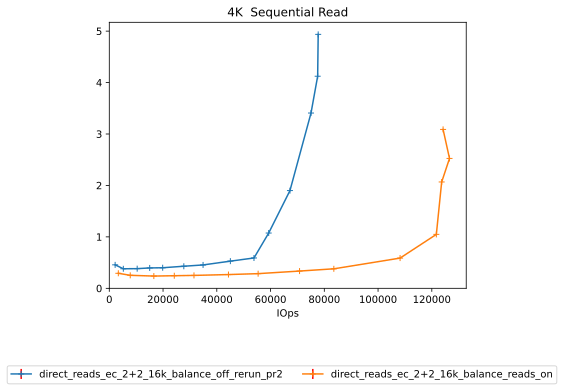|<a name="8192-read"></a>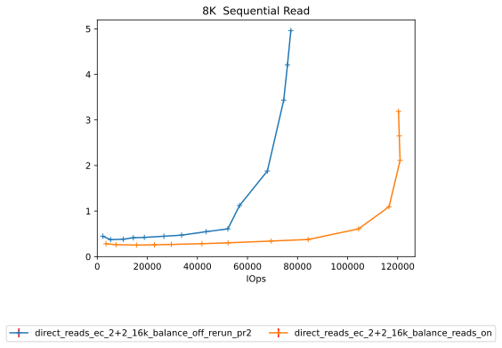|
|<a name="16384-read"></a>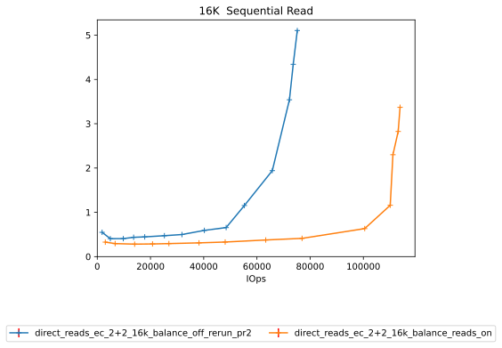|<a name="32768-read"></a>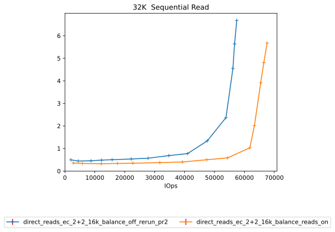|
|<a name="65536-read"></a>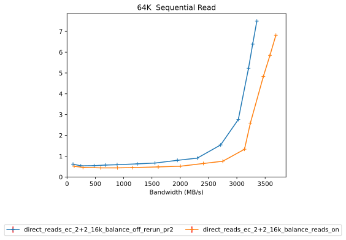|<a name="131072-read"></a>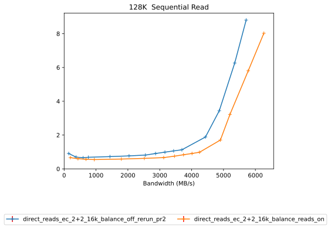|
|<a name="262144-read"></a>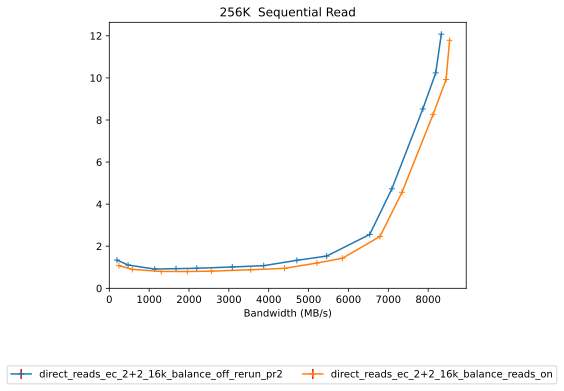|<a name="393216-read"></a>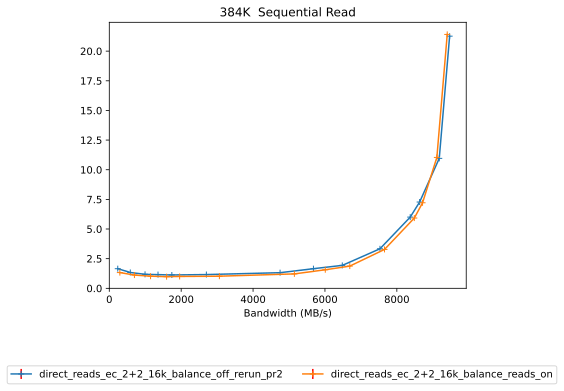|
|<a name="524288-read"></a>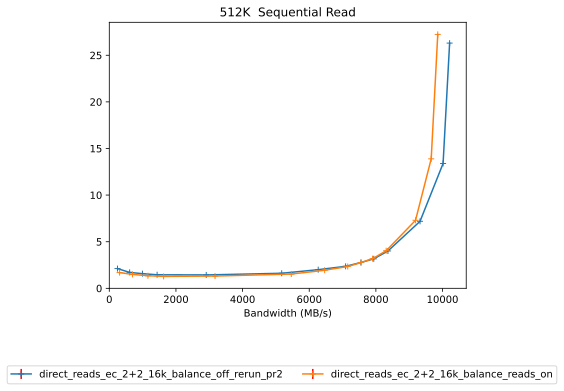|<a name="786432-read"></a>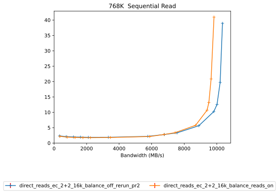|
|<a name="1048576-read"></a>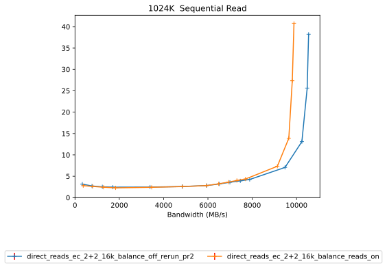|<a name="2097152-read"></a>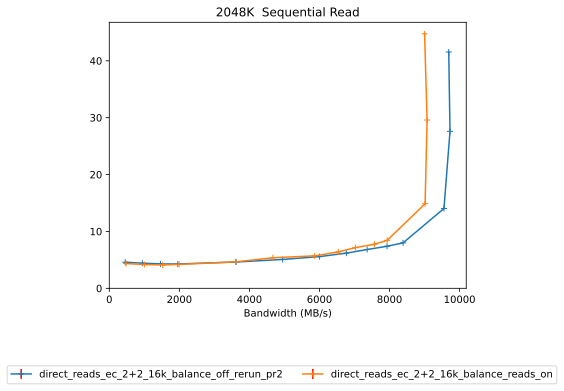|
|<a name="4194304-read"></a>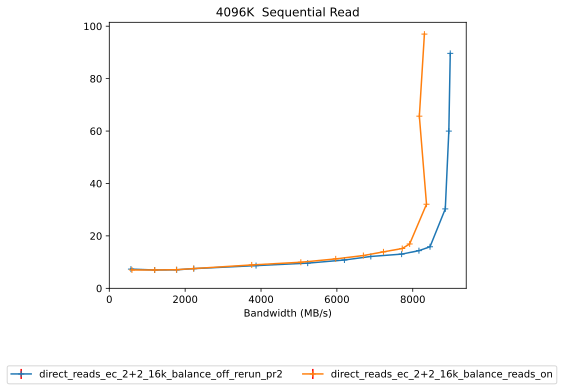||

## Random Read

|||
| :---: | :---: |
|<a name="4096-randread"></a>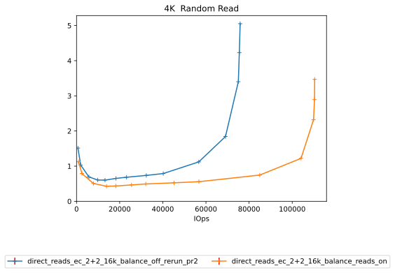|<a name="8192-randread"></a>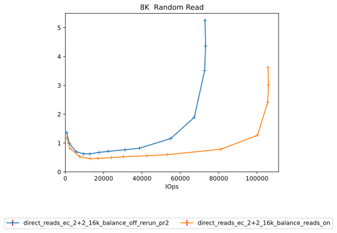|
|<a name="16384-randread"></a>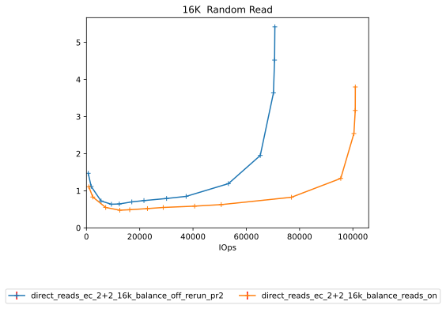|<a name="32768-randread"></a>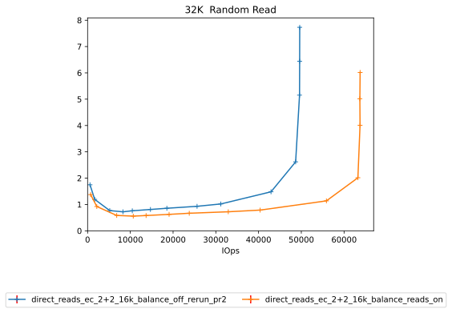|
|<a name="65536-randread"></a>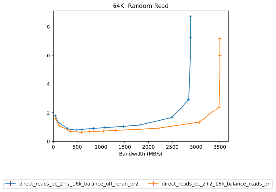|<a name="131072-randread"></a>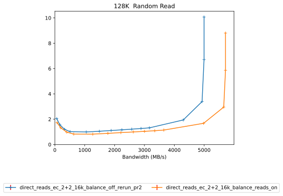|
|<a name="262144-randread"></a>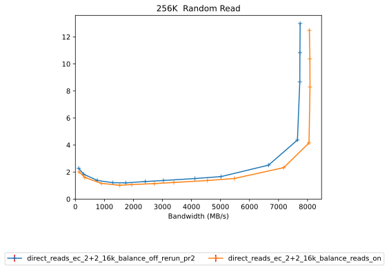|<a name="393216-randread"></a>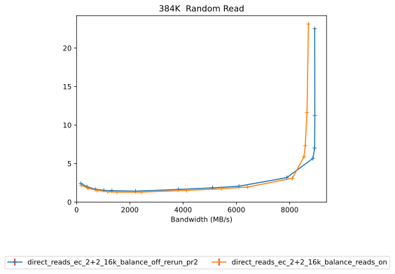|
|<a name="524288-randread"></a>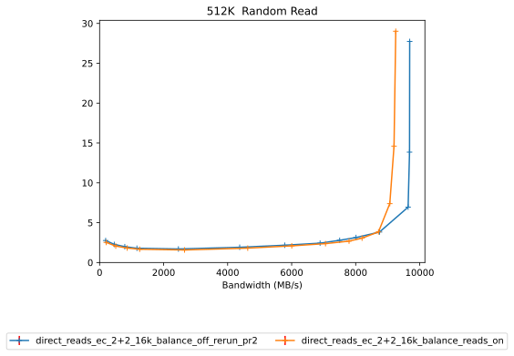|<a name="786432-randread"></a>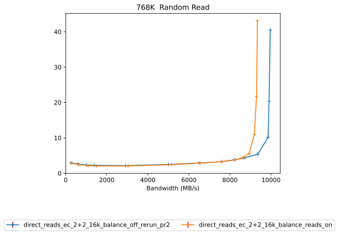|
|<a name="1048576-randread"></a>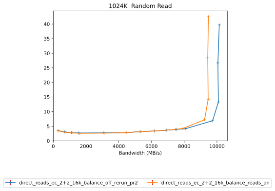|<a name="2097152-randread"></a>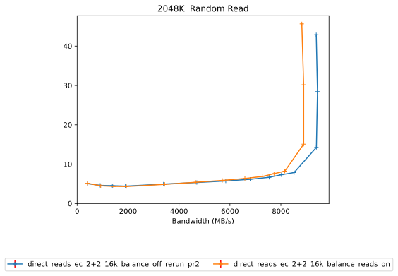|
|<a name="4194304-randread"></a>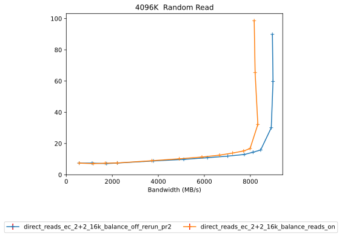||

## Random Read/Write

|||
| :---: | :---: |
|<a name="4096-70-30-randrw"></a>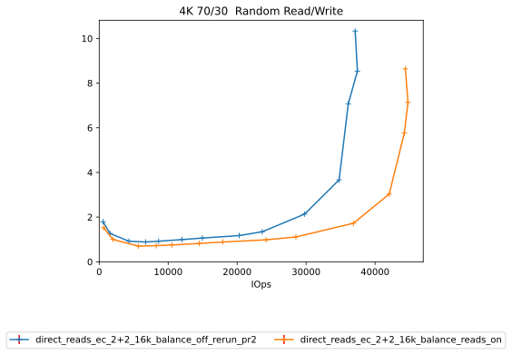|<a name="16384-70-30-randrw"></a>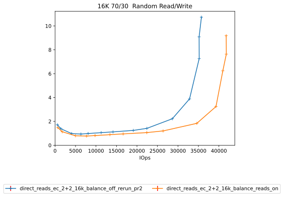|
|<a name="65536-30-70-randrw"></a>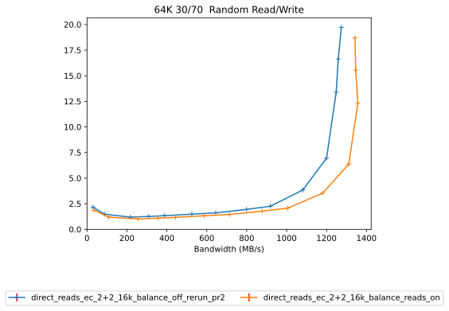|<a name="65536-70-30-randrw"></a>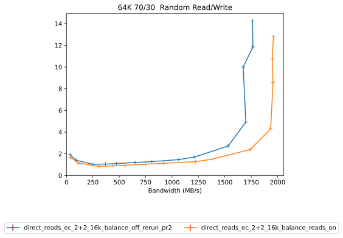|

# Configuration yaml files


Only yaml files that differ by more than 20 lines from the yaml file for the baseline directory will be added here in addition to the baseline yaml  

## results


```benchmarks:
  librbdfio:
    cmd_path: /usr/local/bin/fio2
    create_report: true
    fio_out_format: json
    log_avg_msec: 100
    log_bw: true
    log_iops: true
    log_lat: true
    norandommap: true
    osd_ra:
    - 4096
    poolname: rbd_replicated
    prefill:
      blocksize: 64k
      numjobs: 1
    procs_per_volume:
    - 1
    ramp: 30
    rbdname: cbt-librbdfio
    time: 90
    time_based: true
    use_existing_volumes: true
    vol_size: 1000
    volumes_per_client:
    - 16
    wait_pgautoscaler_timeout: 10
    workloads:
      128krandomread:
        jobname: randread
        mode: randread
        numjobs:
        - 1
        op_size: 131072
        total_iodepth:
        - 1
        - 2
        - 3
        - 4
        - 8
        - 12
        - 16
        - 20
        - 24
        - 28
        - 32
        - 64
        - 128
        - 256
        - 384
      128ksequentialread:
        jobname: seqread
        mode: read
        numjobs:
        - 1
        op_size: 131072
        total_iodepth:
        - 1
        - 2
        - 3
        - 4
        - 8
        - 12
        - 16
        - 20
        - 24
        - 28
        - 32
        - 64
        - 128
        - 256
        - 384
      16kmixread70:
        jobname: mixread
        mode: randrw
        numjobs:
        - 1
        op_size: 16384
        rwmixread: 70
        total_iodepth:
        - 1
        - 2
        - 4
        - 6
        - 8
        - 12
        - 16
        - 24
        - 32
        - 64
        - 128
        - 256
        - 320
        - 384
      16krandomread:
        jobname: randread
        mode: randread
        numjobs:
        - 1
        op_size: 16384
        total_iodepth:
        - 1
        - 2
        - 4
        - 6
        - 8
        - 12
        - 16
        - 24
        - 32
        - 64
        - 128
        - 256
        - 320
        - 384
      16ksequentialread:
        jobname: seqread
        mode: read
        numjobs:
        - 1
        op_size: 16384
        total_iodepth:
        - 1
        - 2
        - 4
        - 6
        - 8
        - 12
        - 16
        - 24
        - 32
        - 64
        - 128
        - 256
        - 320
        - 384
      1Mrandomread:
        jobname: randread
        mode: randread
        numjobs:
        - 1
        op_size: 1048576
        total_iodepth:
        - 1
        - 2
        - 3
        - 4
        - 8
        - 12
        - 16
        - 20
        - 24
        - 28
        - 32
        - 64
        - 128
        - 256
        - 384
      1Msequentialread:
        jobname: seqread
        mode: read
        numjobs:
        - 1
        op_size: 1048576
        total_iodepth:
        - 1
        - 2
        - 3
        - 4
        - 8
        - 12
        - 16
        - 20
        - 24
        - 28
        - 32
        - 64
        - 128
        - 256
        - 384
      256krandomread:
        jobname: randomread
        mode: randread
        numjobs:
        - 1
        op_size: 262144
        total_iodepth:
        - 1
        - 2
        - 4
        - 6
        - 8
        - 12
        - 16
        - 24
        - 32
        - 64
        - 128
        - 256
        - 320
        - 384
      256ksequentialread:
        jobname: seqread
        mode: read
        numjobs:
        - 1
        op_size: 262144
        total_iodepth:
        - 1
        - 2
        - 4
        - 6
        - 8
        - 12
        - 16
        - 24
        - 32
        - 64
        - 128
        - 256
        - 320
        - 384
      2Mrandomread:
        jobname: randread
        mode: randread
        numjobs:
        - 1
        op_size: 2097152
        total_iodepth:
        - 1
        - 2
        - 3
        - 4
        - 8
        - 12
        - 16
        - 20
        - 24
        - 28
        - 32
        - 64
        - 128
        - 192
      2Msequentialread:
        jobname: seqread
        mode: read
        numjobs:
        - 1
        op_size: 2097152
        total_iodepth:
        - 1
        - 2
        - 3
        - 4
        - 8
        - 12
        - 16
        - 20
        - 24
        - 28
        - 32
        - 64
        - 128
        - 192
      32krandomread:
        jobname: randread
        mode: randread
        numjobs:
        - 1
        op_size: 32768
        total_iodepth:
        - 1
        - 2
        - 4
        - 6
        - 8
        - 12
        - 16
        - 24
        - 32
        - 64
        - 128
        - 256
        - 320
        - 384
      32ksequentialread:
        jobname: seqread
        mode: read
        numjobs:
        - 1
        op_size: 32768
        total_iodepth:
        - 1
        - 2
        - 4
        - 6
        - 8
        - 12
        - 16
        - 24
        - 32
        - 64
        - 128
        - 256
        - 320
        - 384
      384krandomread:
        jobname: randread
        mode: randread
        numjobs:
        - 1
        op_size: 393216
        total_iodepth:
        - 1
        - 2
        - 3
        - 4
        - 5
        - 8
        - 16
        - 24
        - 32
        - 64
        - 128
        - 160
        - 256
        - 512
      384ksequentialread:
        jobname: seqread
        mode: read
        numjobs:
        - 1
        op_size: 393216
        total_iodepth:
        - 1
        - 2
        - 3
        - 4
        - 5
        - 8
        - 16
        - 24
        - 32
        - 64
        - 128
        - 160
        - 256
        - 512
      4Mrandomread:
        jobname: randread
        mode: randread
        numjobs:
        - 1
        op_size: 4194304
        total_iodepth:
        - 1
        - 2
        - 3
        - 4
        - 8
        - 12
        - 16
        - 20
        - 24
        - 28
        - 32
        - 64
        - 128
        - 192
      4Msequentialread:
        jobname: seqread
        mode: read
        numjobs:
        - 1
        op_size: 4194304
        total_iodepth:
        - 1
        - 2
        - 3
        - 4
        - 8
        - 12
        - 16
        - 20
        - 24
        - 28
        - 32
        - 64
        - 128
        - 192
      4kmixread70:
        jobname: mixread
        mode: randrw
        numjobs:
        - 1
        op_size: 4096
        rwmixread: 70
        total_iodepth:
        - 1
        - 2
        - 4
        - 6
        - 8
        - 12
        - 16
        - 24
        - 32
        - 64
        - 128
        - 256
        - 320
        - 384
      4krandomread:
        jobname: randread
        mode: randread
        numjobs:
        - 1
        op_size: 4096
        total_iodepth:
        - 1
        - 2
        - 4
        - 6
        - 8
        - 12
        - 16
        - 24
        - 32
        - 64
        - 128
        - 256
        - 320
        - 384
      4ksequentialread:
        jobname: seqread
        mode: read
        numjobs:
        - 1
        op_size: 4096
        total_iodepth:
        - 1
        - 2
        - 4
        - 6
        - 8
        - 12
        - 16
        - 24
        - 32
        - 64
        - 128
        - 256
        - 320
        - 384
      512krandomread:
        jobname: randread
        mode: randread
        numjobs:
        - 1
        op_size: 524288
        total_iodepth:
        - 1
        - 2
        - 3
        - 4
        - 8
        - 16
        - 24
        - 32
        - 40
        - 48
        - 64
        - 128
        - 256
        - 512
      512ksequentialread:
        jobname: seqread
        mode: read
        numjobs:
        - 1
        op_size: 524288
        total_iodepth:
        - 1
        - 2
        - 3
        - 4
        - 8
        - 16
        - 24
        - 32
        - 40
        - 48
        - 64
        - 128
        - 256
        - 512
      64kmixread30:
        jobname: mixread
        mode: randrw
        numjobs:
        - 1
        op_size: 65536
        rwmixread: 30
        total_iodepth:
        - 1
        - 2
        - 4
        - 6
        - 8
        - 12
        - 16
        - 24
        - 32
        - 64
        - 128
        - 256
        - 320
        - 384
      64kmixread70:
        jobname: mixread
        mode: randrw
        numjobs:
        - 1
        op_size: 65536
        rwmixread: 70
        total_iodepth:
        - 1
        - 2
        - 4
        - 6
        - 8
        - 12
        - 16
        - 24
        - 32
        - 64
        - 128
        - 256
        - 320
        - 384
      64krandomread:
        jobname: randread
        mode: randread
        numjobs:
        - 1
        op_size: 65536
        total_iodepth:
        - 1
        - 2
        - 4
        - 6
        - 8
        - 12
        - 16
        - 24
        - 32
        - 64
        - 128
        - 256
        - 320
        - 384
      64ksequentialread:
        jobname: seqread
        mode: read
        numjobs:
        - 1
        op_size: 65536
        total_iodepth:
        - 1
        - 2
        - 4
        - 6
        - 8
        - 12
        - 16
        - 24
        - 32
        - 64
        - 128
        - 256
        - 320
        - 384
      768krandomread:
        jobname: randread
        mode: randread
        numjobs:
        - 1
        op_size: 786432
        total_iodepth:
        - 1
        - 2
        - 3
        - 4
        - 8
        - 16
        - 24
        - 32
        - 40
        - 48
        - 64
        - 128
        - 256
        - 512
      768ksequentialread:
        jobname: seqread
        mode: read
        numjobs:
        - 1
        op_size: 786432
        total_iodepth:
        - 1
        - 2
        - 3
        - 4
        - 5
        - 8
        - 16
        - 24
        - 32
        - 64
        - 128
        - 160
        - 256
        - 512
      8krandomread:
        jobname: randread
        mode: randread
        numjobs:
        - 1
        op_size: 8192
        total_iodepth:
        - 1
        - 2
        - 4
        - 6
        - 8
        - 12
        - 16
        - 24
        - 32
        - 64
        - 128
        - 256
        - 320
        - 384
      8ksequentialread:
        jobname: seqread
        mode: read
        numjobs:
        - 1
        op_size: 8192
        total_iodepth:
        - 1
        - 2
        - 4
        - 6
        - 8
        - 12
        - 16
        - 24
        - 32
        - 64
        - 128
        - 256
        - 320
        - 384
      precondition:
        jobname: precond1rw
        mode: randwrite
        monitor: false
        numjobs:
        - 1
        op_size: 65536
        time: 600
        total_iodepth:
        - 16
cluster:
  archive_dir: /tmp/cbt
  ceph-mgr_cmd: /usr/bin/ceph-mgr
  ceph-mon_cmd: /usr/bin/ceph-mon
  ceph-osd_cmd: /usr/bin/ceph-osd
  ceph-run_cmd: /usr/bin/ceph-run
  ceph_cmd: /usr/bin/ceph
  clients:
  - --- server1 ---
  clusterid: ceph
  conf_file: /cbt/ceph.conf.4x1x1.fs
  fs: xfs
  head: --- server1 ---
  iterations: 1
  mgrs:
    --- server1 ---:
      a: null
  mkfs_opts: -f -i size=2048
  mons:
    --- server1 ---:
      a: --- IP Address ---:6789
  mount_opts: -o inode64,noatime,logbsize=256k
  osds:
  - --- server1 ---
  osds_per_node: 6
  pdsh_ssh_args: -a -x -l%u %h
  rados_cmd: /usr/bin/rados
  rbd_cmd: /usr/bin/rbd
  tmp_dir: /tmp/cbt
  use_existing: true
  user: cjames
monitoring_profiles:
  collectl:
    args: -c 18 -sCD -i 10 -P -oz -F0 --rawtoo --sep ";" -f {collectl_dir}
```