Performance Report for id-1ef58cef
==================================

Table of contents
=================

* [Summary of results for id-1ef58cef](#summary-of-results-for-id-1ef58cef)
* [Response Curves](#response-curves)
	* [Sequential Read](#sequential-read)
	* [Random Read](#random-read)
	* [Random Read/Write](#random-readwrite)
* [Configuration yaml](#configuration-yaml)

# Summary of results for id-1ef58cef
  
|Workload Name|Maximum Throughput|Latency (ms)|  
| :--- | ---: | ---: |  
|[4096_read](#4096-read)|143709 IOps|0.9|6.22|  
|[8192_read](#8192-read)|128312 IOps|2.0|5.57|  
|[16384_read](#16384-read)|114997 IOps|3.3|5.09|  
|[32768_read](#32768-read)|93769 IOps|4.1|4.41|  
|[65536_read](#65536-read)|4924 MB/s|5.1|3.83|  
|[131072_read](#131072-read)|7892 MB/s|6.4|3.49|  
|[262144_read](#262144-read)|11395 MB/s|8.8|3.06|  
|[393216_read](#393216-read)|12083 MB/s|16.7|2.49|  
|[524288_read](#524288-read)|12749 MB/s|21.1|2.17|  
|[786432_read](#786432-read)|12639 MB/s|31.9|1.87|  
|[1048576_read](#1048576-read)|12511 MB/s|10.7|2.04|  
|[2097152_read](#2097152-read)|11441 MB/s|11.7|1.94|  
|[4194304_read](#4194304-read)|10356 MB/s|12.9|1.12|  
|[4096_randread](#4096-randread)|159762 IOps|2.4|12.65|  
|[8192_randread](#8192-randread)|149927 IOps|2.6|11.94|  
|[16384_randread](#16384-randread)|140977 IOps|2.7|11.54|  
|[32768_randread](#32768-randread)|121409 IOps|2.6|9.86|  
|[65536_randread](#65536-randread)|6234 MB/s|4.0|7.87|  
|[131072_randread](#131072-randread)|9393 MB/s|3.6|6.43|  
|[262144_randread](#262144-randread)|12027 MB/s|7.0|4.86|  
|[393216_randread](#393216-randread)|12422 MB/s|5.1|3.87|  
|[524288_randread](#524288-randread)|12548 MB/s|5.3|3.96|  
|[786432_randread](#786432-randread)|12242 MB/s|8.2|3.58|  
|[1048576_randread](#1048576-randread)|12205 MB/s|5.5|3.42|  
|[2097152_randread](#2097152-randread)|11184 MB/s|12.0|1.77|  
|[4194304_randread](#4194304-randread)|10313 MB/s|13.0|1.24|  
|[4096_70_30_randrw](#4096-70-30-randrw)|86087 IOps|3.0|8.96|  
|[16384_70_30_randrw](#16384-70-30-randrw)|77812 IOps|4.1|9.11|  
|[65536_30_70_randrw](#65536-30-70-randrw)|2696 MB/s|7.7|11.67|  
|[65536_70_30_randrw](#65536-70-30-randrw)|3809 MB/s|6.6|9.83|
# Response Curves

## Sequential Read

|||
| :---: | :---: |
|<a name="4096-read"></a>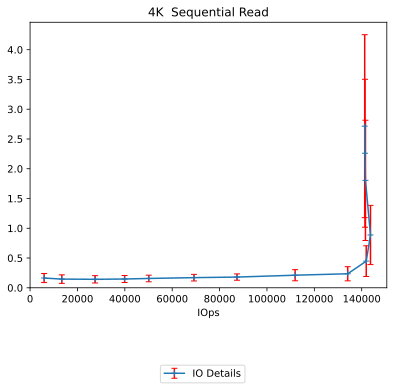|<a name="8192-read"></a>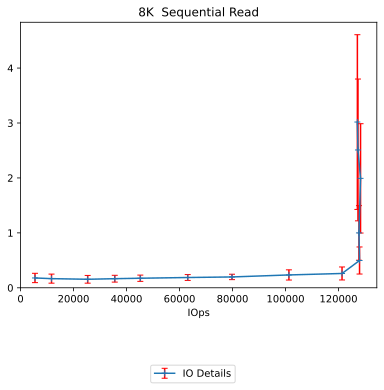|
|<a name="16384-read"></a>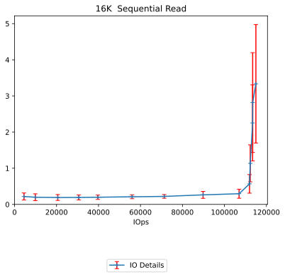|<a name="32768-read"></a>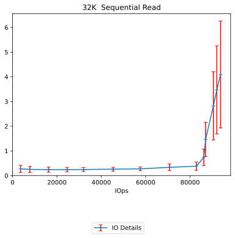|
|<a name="65536-read"></a>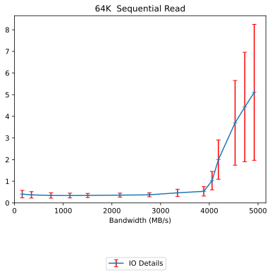|<a name="131072-read"></a>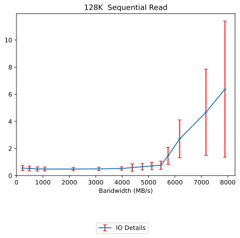|
|<a name="262144-read"></a>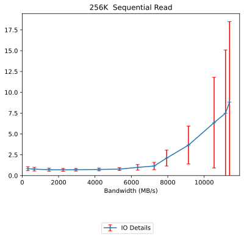|<a name="393216-read"></a>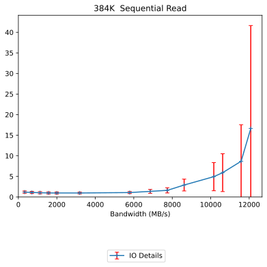|
|<a name="524288-read"></a>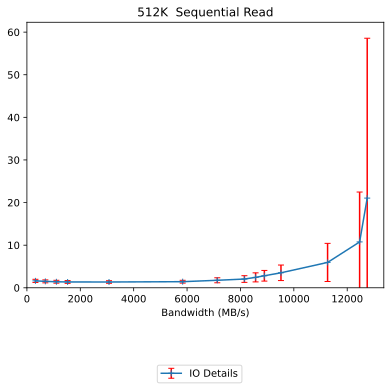|<a name="786432-read"></a>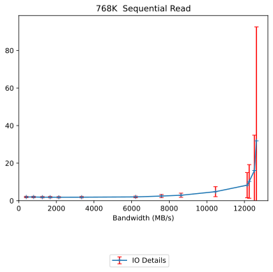|
|<a name="1048576-read"></a>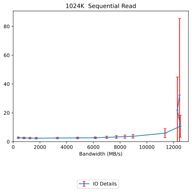|<a name="2097152-read"></a>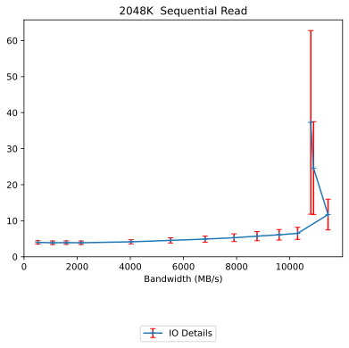|
|<a name="4194304-read"></a>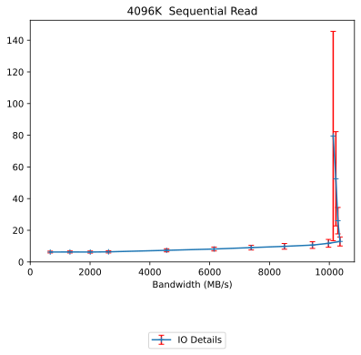||

## Random Read

|||
| :---: | :---: |
|<a name="4096-randread"></a>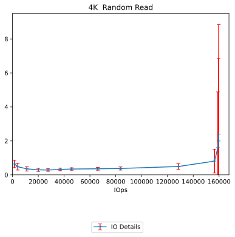|<a name="8192-randread"></a>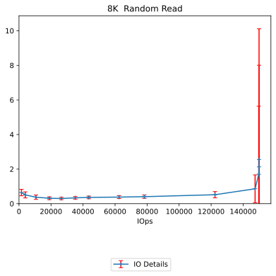|
|<a name="16384-randread"></a>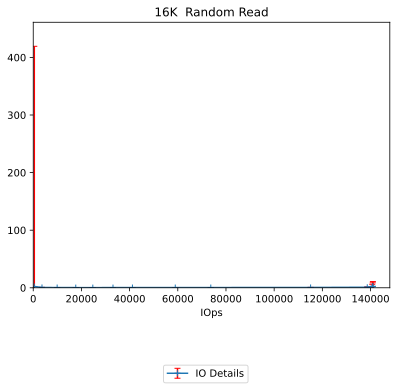|<a name="32768-randread"></a>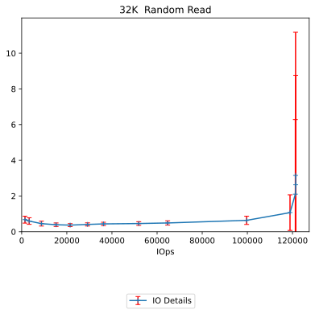|
|<a name="65536-randread"></a>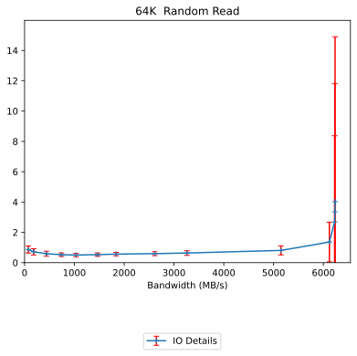|<a name="131072-randread"></a>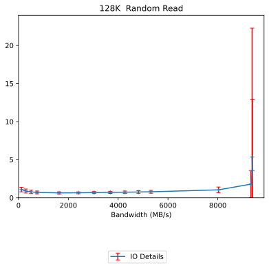|
|<a name="262144-randread"></a>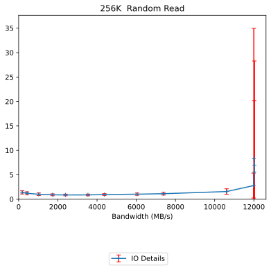|<a name="393216-randread"></a>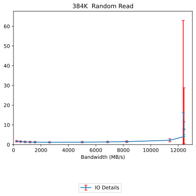|
|<a name="524288-randread"></a>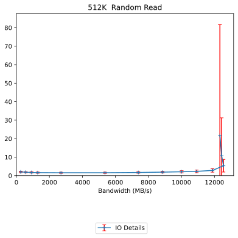|<a name="786432-randread"></a>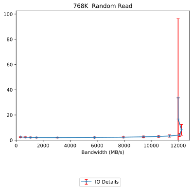|
|<a name="1048576-randread"></a>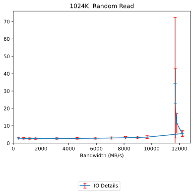|<a name="2097152-randread"></a>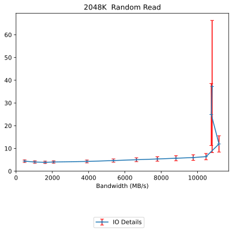|
|<a name="4194304-randread"></a>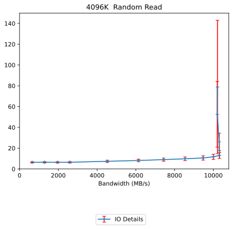||

## Random Read/Write

|||
| :---: | :---: |
|<a name="4096-70-30-randrw"></a>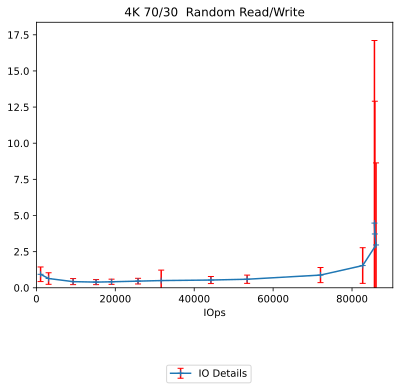|<a name="16384-70-30-randrw"></a>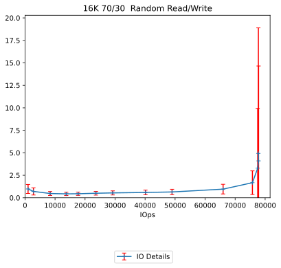|
|<a name="65536-70-30-randrw"></a>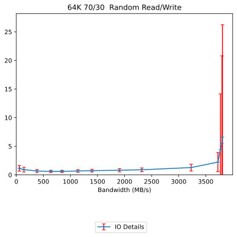|<a name="65536-30-70-randrw"></a>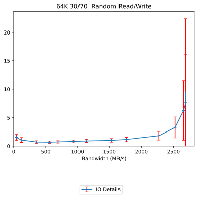|

# Configuration yaml


```benchmarks:
  librbdfio:
    cmd_path: /usr/local/bin/fio2
    create_report: true
    fio_out_format: json
    log_avg_msec: 100
    log_bw: true
    log_iops: true
    log_lat: true
    norandommap: true
    osd_ra:
    - 4096
    poolname: rbd_replicated
    prefill:
      blocksize: 64k
      numjobs: 1
    procs_per_volume:
    - 1
    ramp: 30
    rbdname: cbt-librbdfio
    time: 90
    time_based: true
    use_existing_volumes: true
    vol_size: 1000
    volumes_per_client:
    - 16
    wait_pgautoscaler_timeout: 10
    workloads:
      128krandomread:
        jobname: randread
        mode: randread
        numjobs:
        - 1
        op_size: 131072
        total_iodepth:
        - 1
        - 2
        - 3
        - 4
        - 8
        - 12
        - 16
        - 20
        - 24
        - 28
        - 32
        - 64
        - 128
        - 256
        - 384
      128ksequentialread:
        jobname: seqread
        mode: read
        numjobs:
        - 1
        op_size: 131072
        total_iodepth:
        - 1
        - 2
        - 3
        - 4
        - 8
        - 12
        - 16
        - 20
        - 24
        - 28
        - 32
        - 64
        - 128
        - 256
        - 384
      16kmixread70:
        jobname: mixread
        mode: randrw
        numjobs:
        - 1
        op_size: 16384
        rwmixread: 70
        total_iodepth:
        - 1
        - 2
        - 4
        - 6
        - 8
        - 12
        - 16
        - 24
        - 32
        - 64
        - 128
        - 256
        - 320
        - 384
      16krandomread:
        jobname: randread
        mode: randread
        numjobs:
        - 1
        op_size: 16384
        total_iodepth:
        - 1
        - 2
        - 4
        - 6
        - 8
        - 12
        - 16
        - 24
        - 32
        - 64
        - 128
        - 256
        - 320
        - 384
      16ksequentialread:
        jobname: seqread
        mode: read
        numjobs:
        - 1
        op_size: 16384
        total_iodepth:
        - 1
        - 2
        - 4
        - 6
        - 8
        - 12
        - 16
        - 24
        - 32
        - 64
        - 128
        - 256
        - 320
        - 384
      1Mrandomread:
        jobname: randread
        mode: randread
        numjobs:
        - 1
        op_size: 1048576
        total_iodepth:
        - 1
        - 2
        - 3
        - 4
        - 8
        - 12
        - 16
        - 20
        - 24
        - 28
        - 32
        - 64
        - 128
        - 256
        - 384
      1Msequentialread:
        jobname: seqread
        mode: read
        numjobs:
        - 1
        op_size: 1048576
        total_iodepth:
        - 1
        - 2
        - 3
        - 4
        - 8
        - 12
        - 16
        - 20
        - 24
        - 28
        - 32
        - 64
        - 128
        - 256
        - 384
      256krandomread:
        jobname: randomread
        mode: randread
        numjobs:
        - 1
        op_size: 262144
        total_iodepth:
        - 1
        - 2
        - 4
        - 6
        - 8
        - 12
        - 16
        - 24
        - 32
        - 64
        - 128
        - 256
        - 320
        - 384
      256ksequentialread:
        jobname: seqread
        mode: read
        numjobs:
        - 1
        op_size: 262144
        total_iodepth:
        - 1
        - 2
        - 4
        - 6
        - 8
        - 12
        - 16
        - 24
        - 32
        - 64
        - 128
        - 256
        - 320
        - 384
      2Mrandomread:
        jobname: randread
        mode: randread
        numjobs:
        - 1
        op_size: 2097152
        total_iodepth:
        - 1
        - 2
        - 3
        - 4
        - 8
        - 12
        - 16
        - 20
        - 24
        - 28
        - 32
        - 64
        - 128
        - 192
      2Msequentialread:
        jobname: seqread
        mode: read
        numjobs:
        - 1
        op_size: 2097152
        total_iodepth:
        - 1
        - 2
        - 3
        - 4
        - 8
        - 12
        - 16
        - 20
        - 24
        - 28
        - 32
        - 64
        - 128
        - 192
      32krandomread:
        jobname: randread
        mode: randread
        numjobs:
        - 1
        op_size: 32768
        total_iodepth:
        - 1
        - 2
        - 4
        - 6
        - 8
        - 12
        - 16
        - 24
        - 32
        - 64
        - 128
        - 256
        - 320
        - 384
      32ksequentialread:
        jobname: seqread
        mode: read
        numjobs:
        - 1
        op_size: 32768
        total_iodepth:
        - 1
        - 2
        - 4
        - 6
        - 8
        - 12
        - 16
        - 24
        - 32
        - 64
        - 128
        - 256
        - 320
        - 384
      384krandomread:
        jobname: randread
        mode: randread
        numjobs:
        - 1
        op_size: 393216
        total_iodepth:
        - 1
        - 2
        - 3
        - 4
        - 5
        - 8
        - 16
        - 24
        - 32
        - 64
        - 128
        - 160
        - 256
        - 512
      384ksequentialread:
        jobname: seqread
        mode: read
        numjobs:
        - 1
        op_size: 393216
        total_iodepth:
        - 1
        - 2
        - 3
        - 4
        - 5
        - 8
        - 16
        - 24
        - 32
        - 64
        - 128
        - 160
        - 256
        - 512
      4Mrandomread:
        jobname: randread
        mode: randread
        numjobs:
        - 1
        op_size: 4194304
        total_iodepth:
        - 1
        - 2
        - 3
        - 4
        - 8
        - 12
        - 16
        - 20
        - 24
        - 28
        - 32
        - 64
        - 128
        - 192
      4Msequentialread:
        jobname: seqread
        mode: read
        numjobs:
        - 1
        op_size: 4194304
        total_iodepth:
        - 1
        - 2
        - 3
        - 4
        - 8
        - 12
        - 16
        - 20
        - 24
        - 28
        - 32
        - 64
        - 128
        - 192
      4kmixread70:
        jobname: mixread
        mode: randrw
        numjobs:
        - 1
        op_size: 4096
        rwmixread: 70
        total_iodepth:
        - 1
        - 2
        - 4
        - 6
        - 8
        - 12
        - 16
        - 24
        - 32
        - 64
        - 128
        - 256
        - 320
        - 384
      4krandomread:
        jobname: randread
        mode: randread
        numjobs:
        - 1
        op_size: 4096
        total_iodepth:
        - 1
        - 2
        - 4
        - 6
        - 8
        - 12
        - 16
        - 24
        - 32
        - 64
        - 128
        - 256
        - 320
        - 384
      4ksequentialread:
        jobname: seqread
        mode: read
        numjobs:
        - 1
        op_size: 4096
        total_iodepth:
        - 1
        - 2
        - 4
        - 6
        - 8
        - 12
        - 16
        - 24
        - 32
        - 64
        - 128
        - 256
        - 320
        - 384
      512krandomread:
        jobname: randread
        mode: randread
        numjobs:
        - 1
        op_size: 524288
        total_iodepth:
        - 1
        - 2
        - 3
        - 4
        - 8
        - 16
        - 24
        - 32
        - 40
        - 48
        - 64
        - 128
        - 256
        - 512
      512ksequentialread:
        jobname: seqread
        mode: read
        numjobs:
        - 1
        op_size: 524288
        total_iodepth:
        - 1
        - 2
        - 3
        - 4
        - 8
        - 16
        - 24
        - 32
        - 40
        - 48
        - 64
        - 128
        - 256
        - 512
      64kmixread30:
        jobname: mixread
        mode: randrw
        numjobs:
        - 1
        op_size: 65536
        rwmixread: 30
        total_iodepth:
        - 1
        - 2
        - 4
        - 6
        - 8
        - 12
        - 16
        - 24
        - 32
        - 64
        - 128
        - 256
        - 320
        - 384
      64kmixread70:
        jobname: mixread
        mode: randrw
        numjobs:
        - 1
        op_size: 65536
        rwmixread: 70
        total_iodepth:
        - 1
        - 2
        - 4
        - 6
        - 8
        - 12
        - 16
        - 24
        - 32
        - 64
        - 128
        - 256
        - 320
        - 384
      64krandomread:
        jobname: randread
        mode: randread
        numjobs:
        - 1
        op_size: 65536
        total_iodepth:
        - 1
        - 2
        - 4
        - 6
        - 8
        - 12
        - 16
        - 24
        - 32
        - 64
        - 128
        - 256
        - 320
        - 384
      64ksequentialread:
        jobname: seqread
        mode: read
        numjobs:
        - 1
        op_size: 65536
        total_iodepth:
        - 1
        - 2
        - 4
        - 6
        - 8
        - 12
        - 16
        - 24
        - 32
        - 64
        - 128
        - 256
        - 320
        - 384
      768krandomread:
        jobname: randread
        mode: randread
        numjobs:
        - 1
        op_size: 786432
        total_iodepth:
        - 1
        - 2
        - 3
        - 4
        - 8
        - 16
        - 24
        - 32
        - 40
        - 48
        - 64
        - 128
        - 256
        - 512
      768ksequentialread:
        jobname: seqread
        mode: read
        numjobs:
        - 1
        op_size: 786432
        total_iodepth:
        - 1
        - 2
        - 3
        - 4
        - 5
        - 8
        - 16
        - 24
        - 32
        - 64
        - 128
        - 160
        - 256
        - 512
      8krandomread:
        jobname: randread
        mode: randread
        numjobs:
        - 1
        op_size: 8192
        total_iodepth:
        - 1
        - 2
        - 4
        - 6
        - 8
        - 12
        - 16
        - 24
        - 32
        - 64
        - 128
        - 256
        - 320
        - 384
      8ksequentialread:
        jobname: seqread
        mode: read
        numjobs:
        - 1
        op_size: 8192
        total_iodepth:
        - 1
        - 2
        - 4
        - 6
        - 8
        - 12
        - 16
        - 24
        - 32
        - 64
        - 128
        - 256
        - 320
        - 384
      precondition:
        jobname: precond1rw
        mode: randwrite
        monitor: false
        numjobs:
        - 1
        op_size: 65536
        time: 600
        total_iodepth:
        - 16
cluster:
  archive_dir: /tmp/cbt
  ceph-mgr_cmd: /usr/bin/ceph-mgr
  ceph-mon_cmd: /usr/bin/ceph-mon
  ceph-osd_cmd: /usr/bin/ceph-osd
  ceph-run_cmd: /usr/bin/ceph-run
  ceph_cmd: /usr/bin/ceph
  clients:
  - --- server1 ---
  clusterid: ceph
  conf_file: /cbt/ceph.conf.4x1x1.fs
  fs: xfs
  head: --- server1 ---
  iterations: 1
  mgrs:
    --- server1 ---:
      a: null
  mkfs_opts: -f -i size=2048
  mons:
    --- server1 ---:
      a: --- IP Address ---:6789
  mount_opts: -o inode64,noatime,logbsize=256k
  osds:
  - --- server1 ---
  osds_per_node: 6
  pdsh_ssh_args: -a -x -l%u %h
  rados_cmd: /usr/bin/rados
  rbd_cmd: /usr/bin/rbd
  tmp_dir: /tmp/cbt
  use_existing: true
  user: cjames
monitoring_profiles:
  collectl:
    args: -c 18 -sCD -i 10 -P -oz -F0 --rawtoo --sep ";" -f {collectl_dir}
```