Comparitive Performance Report for main-ec-16K-soko07-2+1-3osd vs main-ec-16K-soko07-2+1-6osd vs stretchy-C-16K-soko07-2+1-3osd vs stretchy-C-16K-soko07-2+1-6osd
=================================================================================================================================================================

Table of contents
=================

* [Comparison summary for main-ec-16K-soko07-2+1-3osd vs main-ec-16K-soko07-2+1-6osd vs stretchy-C-16K-soko07-2+1-3osd vs stretchy-C-16K-soko07-2+1-6osd](#comparison-summary-for-main-ec-16k-soko07-21-3osd-vs-main-ec-16k-soko07-21-6osd-vs-stretchy-c-16k-soko07-21-3osd-vs-stretchy-c-16k-soko07-21-6osd)
* [Response Curves](#response-curves)
	* [Number of Jobs 1](#number-of-jobs-1)
		* [Sequential Read](#sequential-read)
		* [Sequential Write](#sequential-write)
		* [Random Read](#random-read)
		* [Random Write](#random-write)
		* [Random Read/Write](#random-readwrite)
* [Configuration yaml files](#configuration-yaml-files)
	* [results](#results)

# Comparison summary for main-ec-16K-soko07-2+1-3osd vs main-ec-16K-soko07-2+1-6osd vs stretchy-C-16K-soko07-2+1-3osd vs stretchy-C-16K-soko07-2+1-6osd

# Response Curves

## Number of Jobs 1

### Sequential Read

|||
| :---: | :---: |
|<a name="4096-1-read"></a>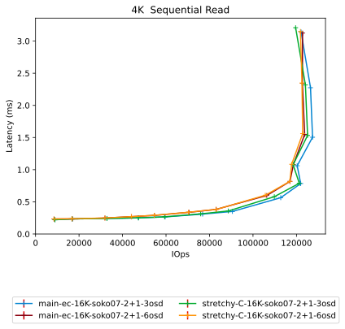|<a name="8192-1-read"></a>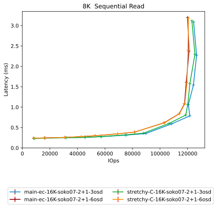|
|<a name="16384-1-read"></a>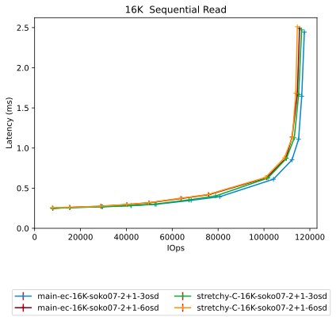|<a name="32768-1-read"></a>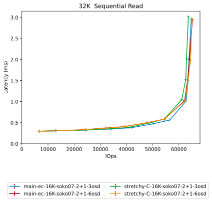|
|<a name="65536-1-read"></a>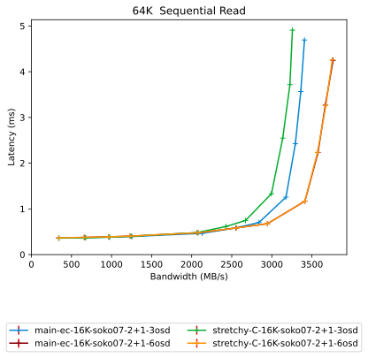|<a name="262144-1-read"></a>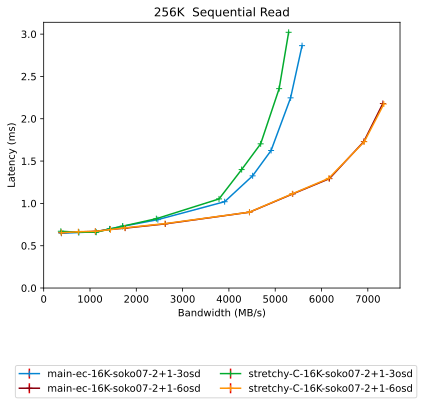|
|<a name="524288-1-read"></a>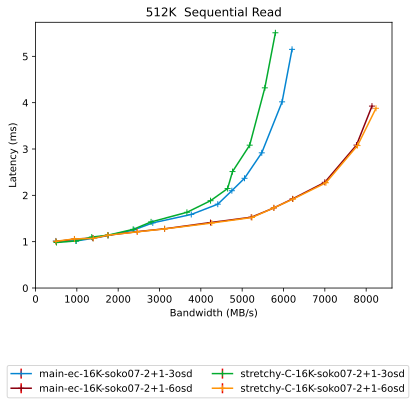|<a name="1048576-1-read"></a>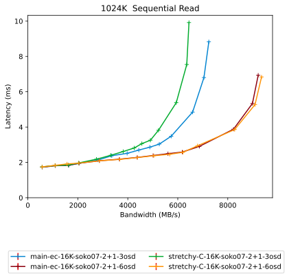|
|<a name="2097152-1-read"></a>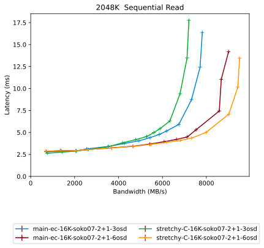|<a name="4194304-1-read"></a>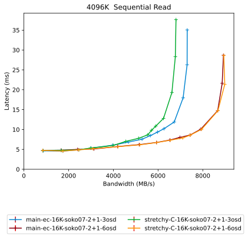|

### Sequential Write

|||
| :---: | :---: |
|<a name="4096-1-write"></a>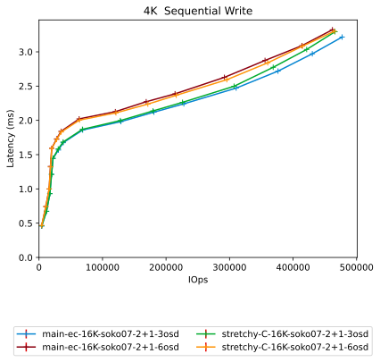|<a name="8192-1-write"></a>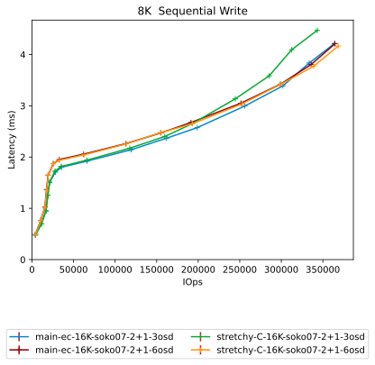|
|<a name="16384-1-write"></a>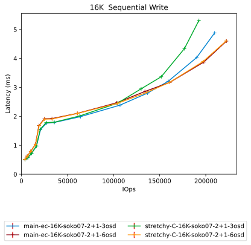|<a name="32768-1-write"></a>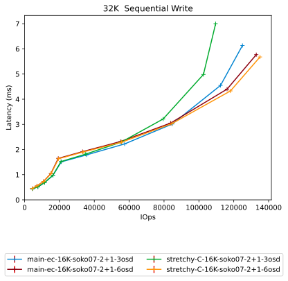|
|<a name="65536-1-write"></a>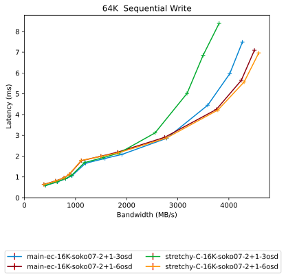|<a name="262144-1-write"></a>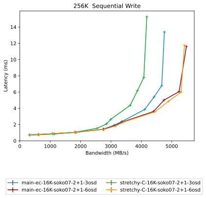|
|<a name="524288-1-write"></a>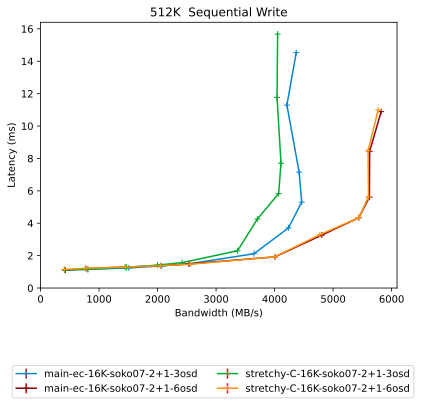|<a name="1048576-1-write"></a>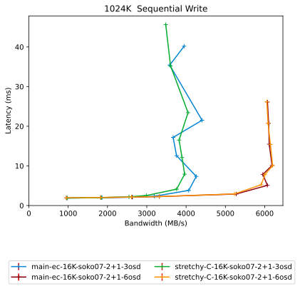|
|<a name="2097152-1-write"></a>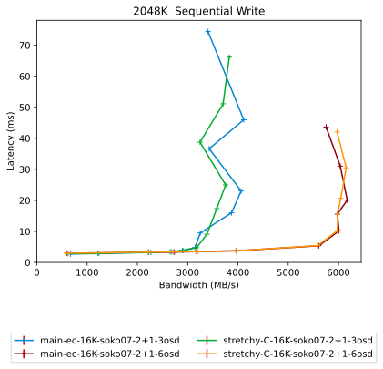|<a name="4194304-1-write"></a>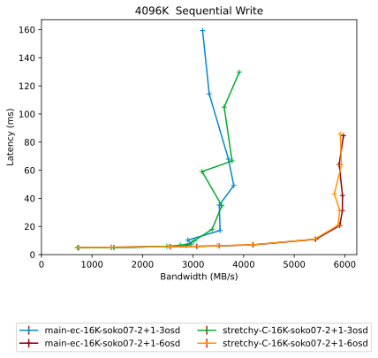|

### Random Read

|||
| :---: | :---: |
|<a name="4096-1-randread"></a>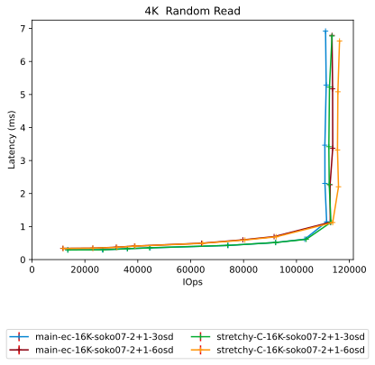|<a name="8192-1-randread"></a>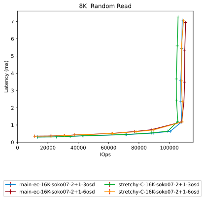|
|<a name="16384-1-randread"></a>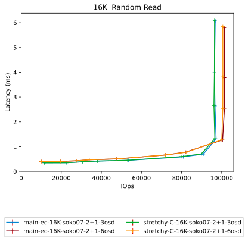|<a name="32768-1-randread"></a>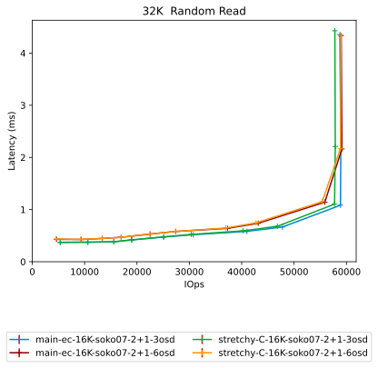|
|<a name="65536-1-randread"></a>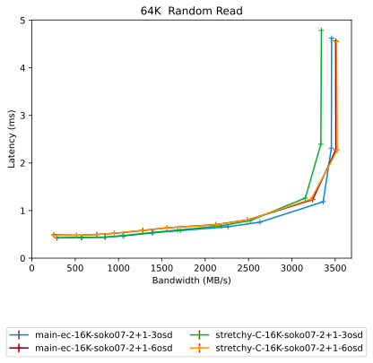|<a name="262144-1-randread"></a>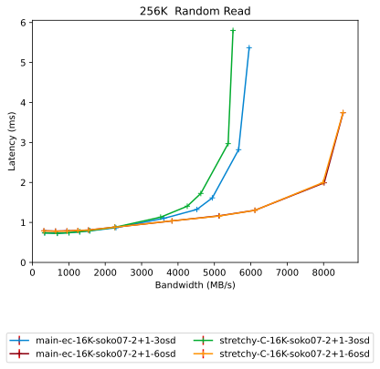|
|<a name="524288-1-randread"></a>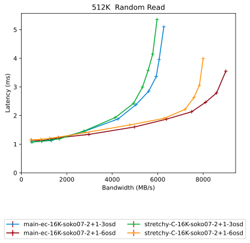|<a name="1048576-1-randread"></a>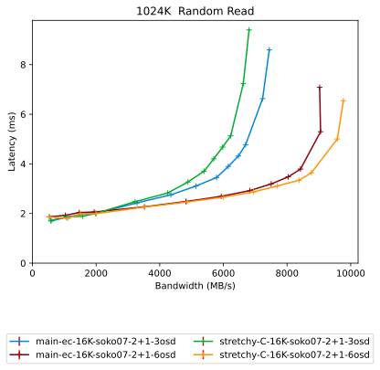|
|<a name="2097152-1-randread"></a>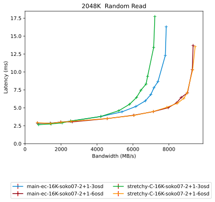|<a name="4194304-1-randread"></a>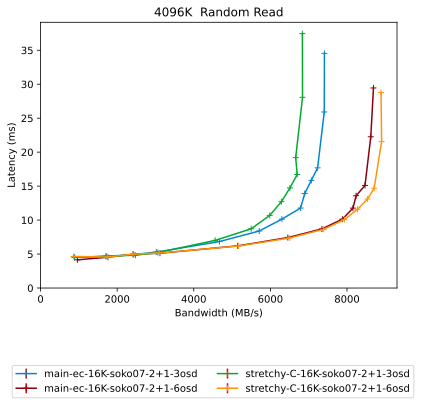|

### Random Write

|||
| :---: | :---: |
|<a name="4096-1-randwrite"></a>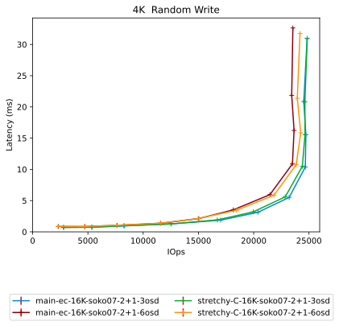|<a name="8192-1-randwrite"></a>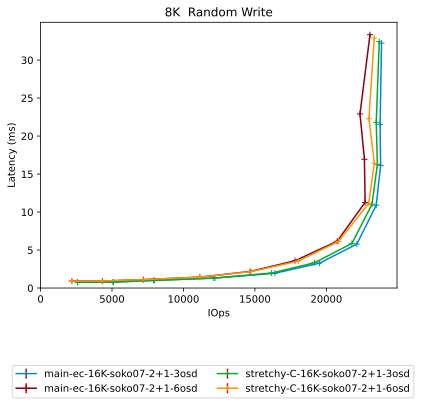|
|<a name="16384-1-randwrite"></a>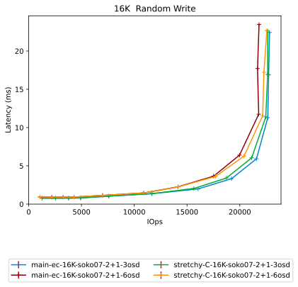|<a name="32768-1-randwrite"></a>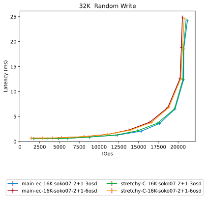|
|<a name="65536-1-randwrite"></a>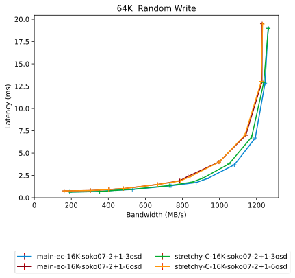|<a name="262144-1-randwrite"></a>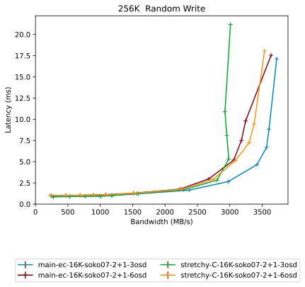|
|<a name="524288-1-randwrite"></a>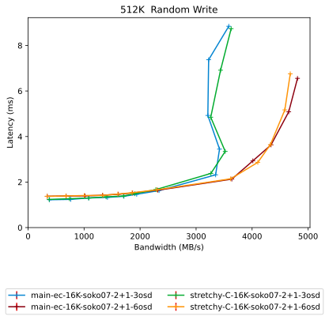|<a name="1048576-1-randwrite"></a>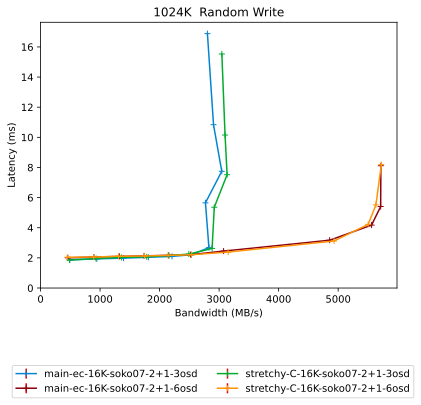|
|<a name="2097152-1-randwrite"></a>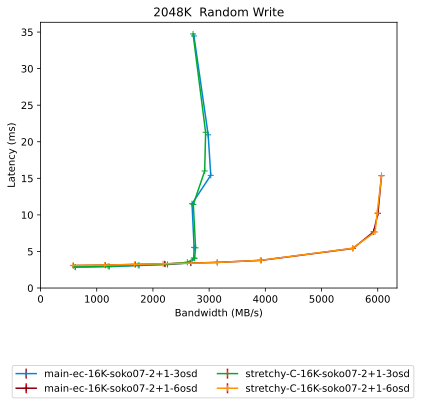|<a name="4194304-1-randwrite"></a>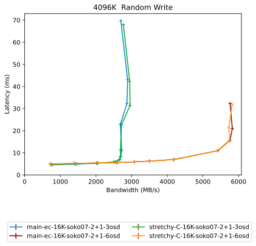|

### Random Read/Write

|||
| :---: | :---: |
|<a name="4096-1-70-30-randrw"></a>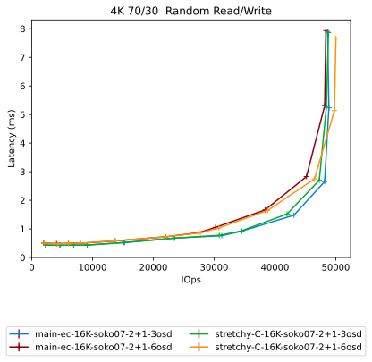|<a name="16384-1-70-30-randrw"></a>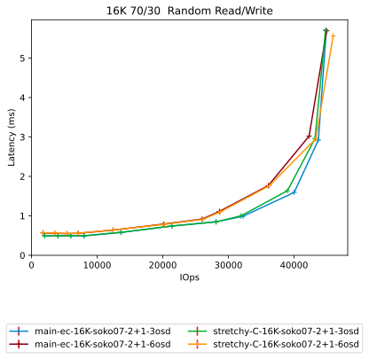|
|<a name="65536-1-30-70-randrw"></a>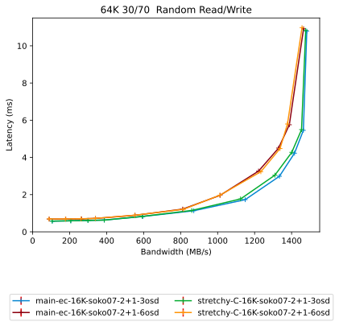|<a name="65536-1-70-30-randrw"></a>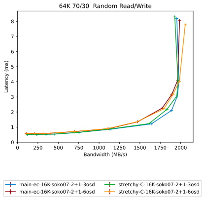|

# Configuration yaml files


Only yaml files that differ by more than 20 lines from the yaml file for the baseline directory will be added here in addition to the baseline yaml  

## results


```benchmarks:
  librbdfio:
    cmd_path: /usr/local/bin/fio
    fio_out_format: json
    log_avg_msec: 100
    log_bw: true
    log_iops: true
    log_lat: true
    norandommap: true
    osd_ra:
    - 4096
    poolname: rbd_replicated
    prefill:
      blocksize: 64k
      numjobs: 1
    procs_per_volume:
    - 1
    ramp: 20
    rbdname: cbt-librbdfio
    time: 60
    time_based: true
    use_existing_volumes: true
    vol_size: 92812
    volumes_per_client:
    - 16
    wait_pgautoscaler_timeout: 10
    workloads:
      16k7030:
        jobname: randmix
        mode: randrw
        numjobs:
        - 1
        op_size: 16384
        rwmixread: 70
        total_iodepth:
        - 1
        - 2
        - 3
        - 4
        - 8
        - 16
        - 24
        - 32
        - 64
        - 128
        - 256
      16krandomread:
        jobname: randread
        mode: randread
        numjobs:
        - 1
        op_size: 16384
        total_iodepth:
        - 4
        - 8
        - 12
        - 16
        - 24
        - 48
        - 64
        - 128
        - 256
        - 384
        - 588
      16krandomwrite:
        jobname: randwrite
        mode: randwrite
        numjobs:
        - 1
        op_size: 16384
        total_iodepth:
        - 1
        - 2
        - 3
        - 4
        - 8
        - 16
        - 32
        - 64
        - 128
        - 256
        - 384
        - 512
      1Mrandomread:
        jobname: randread
        mode: randread
        numjobs:
        - 1
        op_size: 1048576
        total_iodepth:
        - 1
        - 2
        - 3
        - 4
        - 8
        - 12
        - 16
        - 20
        - 24
        - 28
        - 32
        - 48
        - 64
      1Mrandomwrite:
        jobname: randwrite
        mode: randwrite
        numjobs:
        - 1
        op_size: 1048576
        total_iodepth:
        - 1
        - 2
        - 3
        - 4
        - 5
        - 6
        - 8
        - 16
        - 24
        - 32
        - 48
      1Mseqread:
        jobname: seqread
        mode: read
        numjobs:
        - 1
        op_size: 1048576
        total_iodepth:
        - 1
        - 2
        - 3
        - 4
        - 6
        - 8
        - 10
        - 12
        - 14
        - 16
        - 20
        - 32
        - 48
        - 64
      1Mseqwrite:
        jobname: seqwrite
        mode: write
        numjobs:
        - 1
        op_size: 1048576
        total_iodepth:
        - 2
        - 4
        - 6
        - 8
        - 16
        - 32
        - 48
        - 64
        - 96
        - 128
        - 160
      256krandomread:
        jobname: randread
        mode: randread
        numjobs:
        - 1
        op_size: 262144
        total_iodepth:
        - 1
        - 2
        - 3
        - 4
        - 5
        - 8
        - 16
        - 24
        - 32
        - 64
        - 128
      256krandomwrite:
        jobname: randwrite
        mode: randwrite
        numjobs:
        - 1
        op_size: 262144
        total_iodepth:
        - 1
        - 2
        - 3
        - 4
        - 5
        - 8
        - 16
        - 32
        - 64
        - 96
        - 128
        - 256
      2Mrandomread:
        jobname: randread
        mode: randread
        numjobs:
        - 1
        op_size: 2097152
        total_iodepth:
        - 1
        - 2
        - 3
        - 4
        - 8
        - 12
        - 16
        - 20
        - 24
        - 28
        - 32
        - 48
        - 64
      2Mrandomwrite:
        jobname: randwrite
        mode: randwrite
        numjobs:
        - 1
        op_size: 2097152
        total_iodepth:
        - 1
        - 2
        - 3
        - 4
        - 5
        - 6
        - 8
        - 16
        - 24
        - 32
        - 48
      2Mseqread:
        jobname: seqread
        mode: read
        numjobs:
        - 1
        op_size: 2097152
        total_iodepth:
        - 1
        - 2
        - 3
        - 4
        - 6
        - 8
        - 10
        - 12
        - 14
        - 16
        - 20
        - 32
        - 48
        - 64
      2Mseqwrite:
        jobname: seqwrite
        mode: write
        numjobs:
        - 1
        op_size: 2097152
        total_iodepth:
        - 1
        - 2
        - 4
        - 5
        - 6
        - 8
        - 16
        - 32
        - 48
        - 64
        - 96
        - 128
      32krandomread:
        jobname: randread
        mode: randread
        numjobs:
        - 1
        op_size: 32768
        total_iodepth:
        - 2
        - 4
        - 6
        - 8
        - 12
        - 16
        - 24
        - 32
        - 64
        - 128
        - 256
      32krandomwrite:
        jobname: randwrite
        mode: randwrite
        numjobs:
        - 1
        op_size: 32768
        total_iodepth:
        - 1
        - 2
        - 3
        - 4
        - 8
        - 16
        - 32
        - 64
        - 128
        - 256
        - 384
        - 512
      4Mrandomread:
        jobname: randread
        mode: randread
        numjobs:
        - 1
        op_size: 4194304
        total_iodepth:
        - 1
        - 2
        - 3
        - 4
        - 8
        - 12
        - 16
        - 20
        - 24
        - 28
        - 32
        - 48
        - 64
      4Mrandomwrite:
        jobname: randwrite
        mode: randwrite
        numjobs:
        - 1
        op_size: 4194304
        total_iodepth:
        - 1
        - 2
        - 3
        - 4
        - 5
        - 6
        - 8
        - 16
        - 24
        - 32
        - 48
      4Mseqread:
        jobname: seqread
        mode: read
        numjobs:
        - 1
        op_size: 4194304
        total_iodepth:
        - 1
        - 2
        - 3
        - 4
        - 6
        - 8
        - 10
        - 12
        - 14
        - 16
        - 20
        - 32
        - 48
        - 64
      4Mseqwrite:
        jobname: seqwrite
        mode: write
        numjobs:
        - 1
        op_size: 4194304
        total_iodepth:
        - 1
        - 2
        - 4
        - 5
        - 6
        - 8
        - 16
        - 32
        - 48
        - 64
        - 96
        - 128
      4k7030:
        jobname: randmix
        mode: randrw
        numjobs:
        - 1
        op_size: 4096
        rwmixread: 70
        total_iodepth:
        - 1
        - 2
        - 3
        - 4
        - 8
        - 16
        - 24
        - 32
        - 64
        - 128
        - 256
        - 384
      4krandomread:
        jobname: randread
        mode: randread
        numjobs:
        - 1
        op_size: 4096
        total_iodepth:
        - 4
        - 8
        - 12
        - 16
        - 32
        - 48
        - 64
        - 128
        - 256
        - 384
        - 588
        - 768
      4krandomwrite:
        jobname: randwrite
        mode: randwrite
        numjobs:
        - 1
        op_size: 4096
        total_iodepth:
        - 2
        - 4
        - 8
        - 16
        - 32
        - 64
        - 128
        - 256
        - 384
        - 512
        - 768
      512krandomread:
        jobname: randread
        mode: randread
        numjobs:
        - 1
        op_size: 524288
        total_iodepth:
        - 1
        - 2
        - 3
        - 4
        - 8
        - 16
        - 24
        - 32
        - 40
        - 48
        - 64
      512krandomwrite:
        jobname: randwrite
        mode: randwrite
        numjobs:
        - 1
        op_size: 524288
        total_iodepth:
        - 1
        - 2
        - 3
        - 4
        - 5
        - 6
        - 8
        - 16
        - 24
        - 32
        - 48
        - 64
      512kseqread:
        jobname: seqread
        mode: read
        numjobs:
        - 1
        op_size: 524288
        total_iodepth:
        - 1
        - 2
        - 3
        - 4
        - 6
        - 8
        - 12
        - 16
        - 20
        - 24
        - 32
        - 48
        - 64
      512kseqwrite:
        jobname: seqwrite
        mode: write
        numjobs:
        - 1
        op_size: 524288
        total_iodepth:
        - 1
        - 2
        - 4
        - 6
        - 8
        - 16
        - 32
        - 48
        - 64
        - 96
        - 128
      64k3070:
        jobname: randmix
        mode: randrw
        numjobs:
        - 1
        op_size: 65536
        rwmixread: 30
        total_iodepth:
        - 1
        - 2
        - 3
        - 4
        - 8
        - 16
        - 32
        - 64
        - 96
        - 128
        - 256
      64k7030:
        jobname: randmix
        mode: randrw
        numjobs:
        - 1
        op_size: 65536
        rwmixread: 70
        total_iodepth:
        - 1
        - 2
        - 3
        - 4
        - 8
        - 16
        - 32
        - 64
        - 96
        - 128
        - 256
      64krandomread:
        jobname: randread
        mode: randread
        numjobs:
        - 1
        op_size: 65536
        total_iodepth:
        - 2
        - 4
        - 6
        - 8
        - 12
        - 16
        - 24
        - 32
        - 64
        - 128
        - 256
      64krandomwrite:
        jobname: randwrite
        mode: randwrite
        numjobs:
        - 1
        op_size: 65536
        total_iodepth:
        - 2
        - 4
        - 6
        - 8
        - 16
        - 24
        - 32
        - 64
        - 128
        - 256
        - 384
      64kseqread:
        jobname: read
        mode: read
        numjobs:
        - 1
        op_size: 65536
        total_iodepth:
        - 2
        - 4
        - 6
        - 8
        - 16
        - 24
        - 32
        - 64
        - 128
        - 192
        - 256
      64kseqwrite:
        jobname: write
        mode: write
        numjobs:
        - 1
        op_size: 65536
        total_iodepth:
        - 4
        - 8
        - 12
        - 16
        - 32
        - 48
        - 64
        - 128
        - 256
        - 384
        - 512
      8krandomread:
        jobname: randread
        mode: randread
        numjobs:
        - 1
        op_size: 8192
        total_iodepth:
        - 4
        - 8
        - 12
        - 16
        - 32
        - 48
        - 64
        - 128
        - 256
        - 384
        - 588
        - 768
      8krandomwrite:
        jobname: randwrite
        mode: randwrite
        numjobs:
        - 1
        op_size: 8192
        total_iodepth:
        - 2
        - 4
        - 8
        - 16
        - 32
        - 64
        - 128
        - 256
        - 384
        - 512
        - 768
      precondition:
        jobname: precond1rw
        mode: randwrite
        monitor: false
        numjobs:
        - 1
        op_size: 65536
        time: 120
        total_iodepth:
        - 16
      seq16kread:
        jobname: seqread
        mode: read
        numjobs:
        - 1
        op_size: 16384
        total_iodepth:
        - 2
        - 4
        - 8
        - 12
        - 16
        - 24
        - 32
        - 64
        - 96
        - 128
        - 192
        - 288
      seq16kwrite:
        jobname: seqwrite
        mode: write
        numjobs:
        - 1
        op_size: 16384
        total_iodepth:
        - 2
        - 4
        - 8
        - 16
        - 32
        - 48
        - 64
        - 128
        - 256
        - 384
        - 512
        - 768
        - 1024
      seq256kread:
        jobname: seqread
        mode: read
        numjobs:
        - 1
        op_size: 262144
        total_iodepth:
        - 1
        - 2
        - 3
        - 4
        - 5
        - 8
        - 16
        - 24
        - 32
        - 48
        - 64
      seq256kwrite:
        jobname: seqwrite
        mode: write
        numjobs:
        - 1
        op_size: 262144
        total_iodepth:
        - 1
        - 2
        - 4
        - 8
        - 16
        - 24
        - 32
        - 64
        - 96
        - 128
        - 256
      seq32kread:
        jobname: seqread
        mode: read
        numjobs:
        - 1
        op_size: 32768
        total_iodepth:
        - 2
        - 4
        - 8
        - 12
        - 16
        - 24
        - 32
        - 64
        - 96
        - 128
        - 192
      seq32kwrite:
        jobname: seqwrite
        mode: write
        numjobs:
        - 1
        op_size: 32768
        total_iodepth:
        - 2
        - 4
        - 8
        - 16
        - 32
        - 64
        - 128
        - 256
        - 512
        - 768
      seq4kread:
        jobname: seqread
        mode: read
        numjobs:
        - 1
        op_size: 4096
        total_iodepth:
        - 2
        - 4
        - 8
        - 12
        - 16
        - 24
        - 32
        - 64
        - 96
        - 128
        - 192
        - 288
        - 384
      seq4kwrite:
        jobname: seqwrite
        mode: write
        numjobs:
        - 1
        op_size: 4096
        total_iodepth:
        - 2
        - 8
        - 16
        - 24
        - 32
        - 48
        - 64
        - 128
        - 256
        - 384
        - 512
        - 768
        - 1024
        - 1280
        - 1536
      seq8kread:
        jobname: seqread
        mode: read
        numjobs:
        - 1
        op_size: 8192
        total_iodepth:
        - 2
        - 4
        - 8
        - 12
        - 16
        - 24
        - 32
        - 64
        - 96
        - 128
        - 192
        - 288
        - 384
      seq8kwrite:
        jobname: seqwrite
        mode: write
        numjobs:
        - 1
        op_size: 8192
        total_iodepth:
        - 2
        - 8
        - 16
        - 24
        - 32
        - 48
        - 64
        - 128
        - 256
        - 384
        - 512
        - 768
        - 1024
        - 1280
        - 1536
cluster:
  archive_dir: /tmp/cbt
  ceph-mgr_cmd: /usr/bin/ceph-mgr
  ceph-mon_cmd: /usr/bin/ceph-mon
  ceph-osd_cmd: /usr/bin/ceph-osd
  ceph-run_cmd: /usr/bin/ceph-run
  ceph_cmd: /usr/bin/ceph
  clients:
  - --- server1 ---
  clusterid: ceph
  conf_file: /cbt/ceph.conf.4x1x1.fs
  fs: xfs
  head: --- server1 ---
  iterations: 1
  mgrs:
    --- server1 ---:
      a: null
  mkfs_opts: -f -i size=2048
  mons:
    --- server1 ---:
      a: --- IP Address ---:6789
  mount_opts: -o inode64,noatime,logbsize=256k
  osds:
  - --- server1 ---
  osds_per_node: 8
  pdsh_cmd: /bin/pdsh
  pdsh_ssh_args: -a -x -l%u %h
  pid_dir: /tmp/cbt/pid
  rados_cmd: /usr/bin/rados
  rbd_cmd: /usr/bin/rbd
  tmp_dir: /tmp/cbt
  use_existing: true
  user: root
monitoring_profiles:
  collectl:
    args: -c 18 -oz -sZC -i 10 --sep ";" -F0 -P -f {collectl_dir}
```